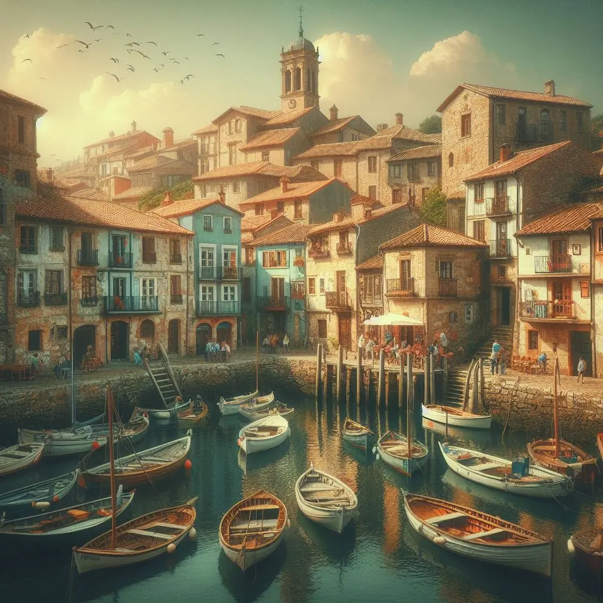
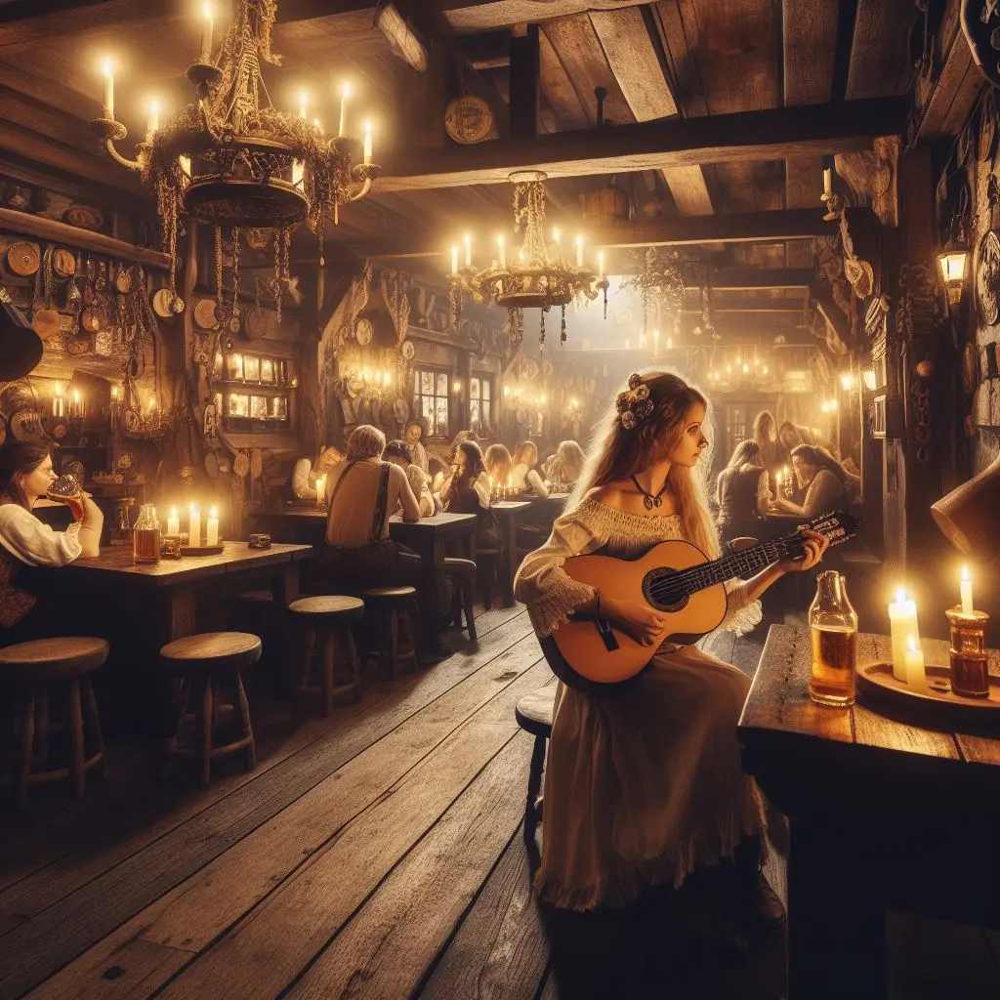

En un pintoresc poble costaner de Castella anomenat Valdeluna, on les onades acaricien la sorra i els somnis es confonen amb la brisa marina, el destí començava a traçar la història d’una gran aventura. Un grup de viatgers, desconeguts entre si, portava a les espatlles el pes de relats mai explicats. En els seus ulls es reflectia la promesa d’una odissea que tot just començava.

A mesura que el sol s’enfonsava a l’horitzó, els seus passos els van portar pels carrerons empedrats fins a una taverna, refugi de mariners, bandolers i corsaris. Un santuari de fusta i pedra on les seves vides s’entrellaçarien per primera vegada. L’ambient era càlid, ple de rialles, murmuris i la remor d’un violí desafinat. Les espelmes tremolaven com cors inquiets, mentre l’aire s’omplia d’aromes de cervesa, vi ranci i promeses de fortuna.

Aquella nit, la taverna va ser testimoni de disputes, brindis eufòrics i paraules murmurades en l’ombra. La música i el xivarri creaven una melodia pròpia, una simfonia de destins que es trobaven i es posaven a prova. Els daus rodolaven, les monedes canviaven de mans amb rapidesa i les cartes es llançaven a la taula amb la mateixa destresa que les dagues es brandaven en la foscor. Un brindis es va alçar per aquells que s'atrevien a desafiar el destí, mentre un vell mariner explicava històries de monstres marins i ciutats enfonsades.

La nit avançava i els habitants de la taverna sucumbien un per un al regne dels somnis.

Entre ells, Sir God netejava la seva Panzerhand, tacada de maquillatge barat, mentre reflexionava sobre el seu següent moviment. Va prendre una decisió senzilla: Vladimir i a dormir. Amb aquesta resolució presa, va permetre que el cansament l’envaís i es va deixar caure en un son profund, embolicat en plans i estratègies futures.

Després del seu intent fallit de robar a Sir God, l’Alina rumiava sobre la seva compatriota Luna. La nit havia pres un gir inesperat, i va comprendre que necessitava dominar el seu ressentiment cap a la noblesa si volia evitar més conflictes. No obstant això, abans de rendir-se al son, un somriure maliciós es va dibuixar als seus llavis.

La Luna, inquieta pel desenllaç del seu pla per donar una lliçó a Sir God, es va retirar a descansar, decidida a explicar la seva desaparició a en Reiv amb la llum del dia. En els seus somnis es veia navegant cap a futures aventures com a marinera pirata, anhelant començar una nova vida en alta mar.

Mentrestant, en Reiv restava a la barra, preguntant-se on podria haver anat la seva encisadora companya de ball, la Luna, que havia desaparegut sense deixar rastre. “On haurà anat?”, va preguntar amb preocupació al propietari. Poc després, el seu cap va colpejar amb força contra la sòlida barra de roure, caient en un profund somni.

Kelsier, un dels darrers borratxos que quedaven desperts, buscava pistes sobre el parador de Lord Ham, un enigma que el consumia. Malgrat la seva determinació, la nit no va revelar cap secret. “Demà tindré més sort”, va murmurar abans de desplomar-se entre cadires buides i taules desordenades.

La taverna de Valdeluna va quedar en silenci. L'alba s'acostava, dibuixant un dia especial per aquest grup de desconeguts, els destins dels quals s’entrellaçaven en una recerca que tot just començava.
