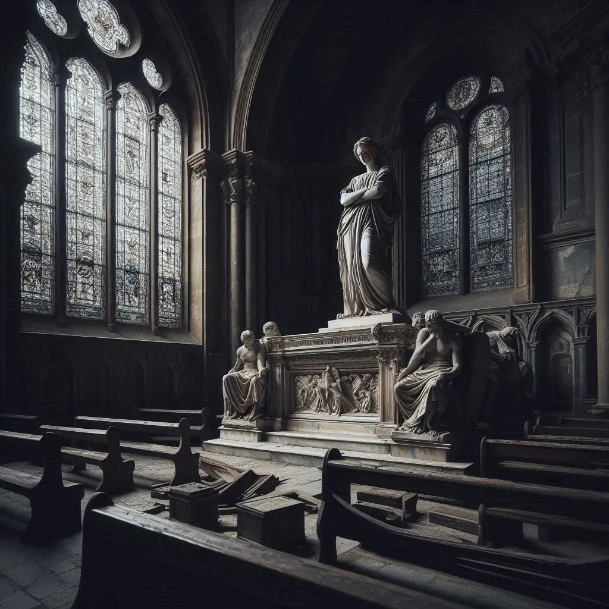
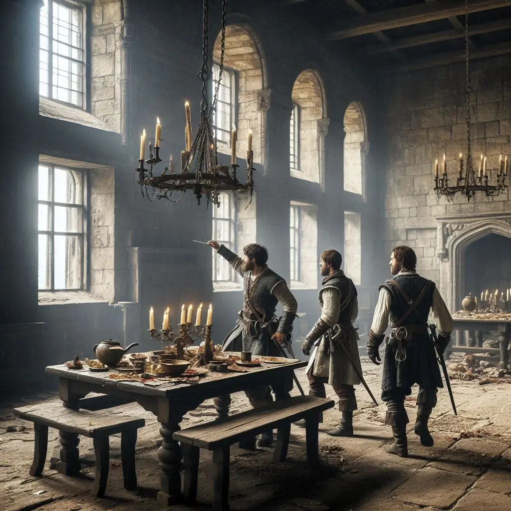
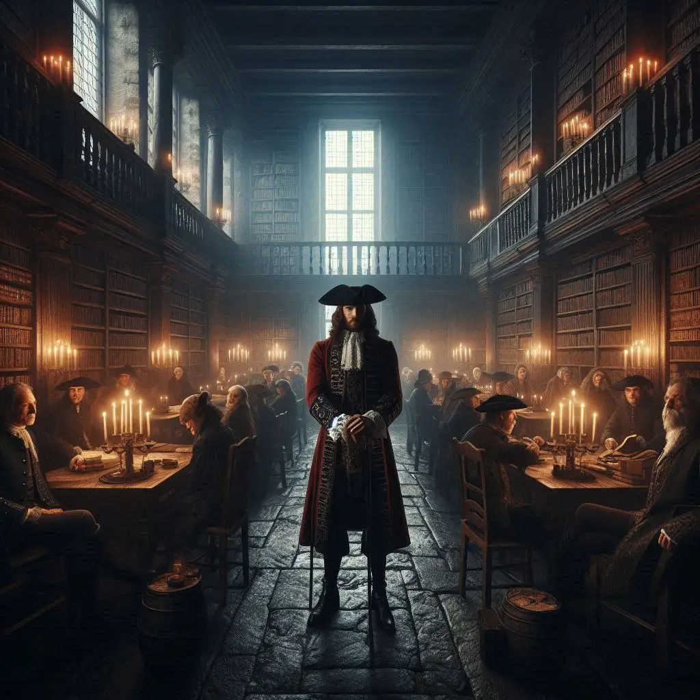
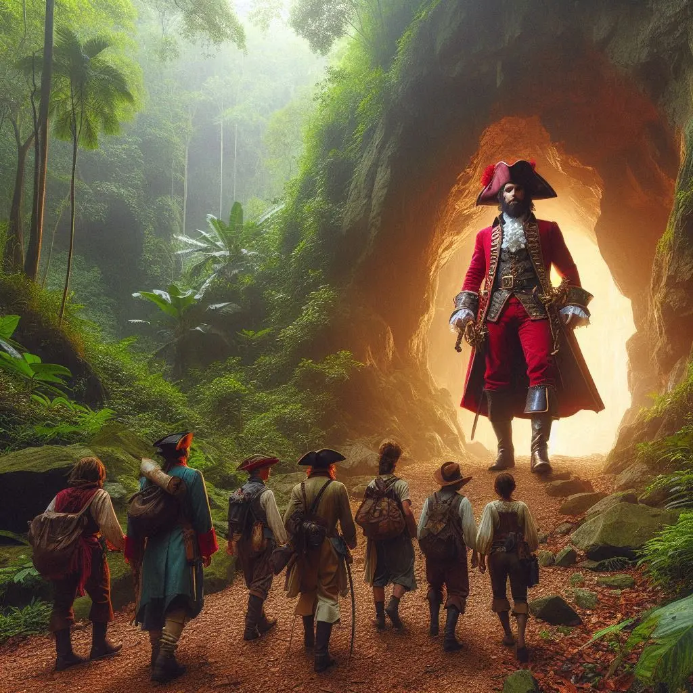
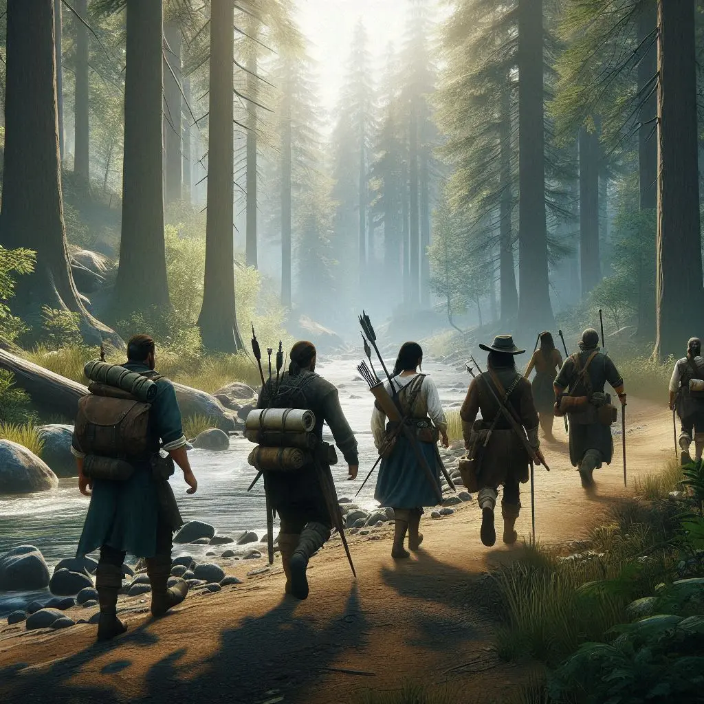
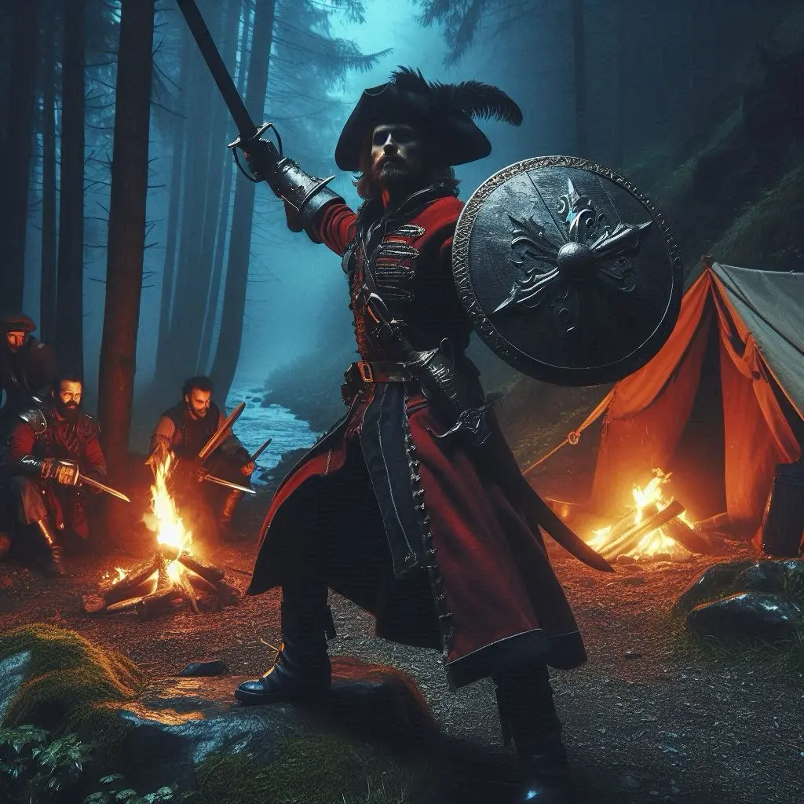

Ens endinsàrem a través de la porta en la penombra d'una antiga església Theana, abandonada i oblidada pel pas del temps. Bancs de fusta desgastats es dispersaven pel recinte, testimonis silenciosos d’una època passada. Hi havia dues portes laterals, tancades. Al fons, una imponent estàtua de marbre mostrava una verge amb els braços plegats, dominant l'espai amb una presència majestuosa. Una llàgrima de sang lluïa per la seva galta, com si plorés per les ànimes perdudes. Al pedestal, una inscripció en llengua antiga cridà la nostra atenció: “Ἀεὶ ὁ θεὸς γεωμετρεῖ.”

Davant d'ella, m'agenollí en un gest de veneració i murmuré pregàries amb desesperació. La llum tènue que s’escolava a través dels vitralls trencats banyava l’estàtua amb una aura celestial. El silenci era profund, només trencat pel so suau de les meves pròpies pregàries i el batec inquiet del meu cor. Aquí, en aquest santuari oblidat, cercava la força per enfrontar-me als perills que encara ens esperaven.

Mentrestant, en Gunnar, en Kelsier i en Kamui exploraven la sala esquerra, descobrint un ampli menjador envoltat per diverses portes. Algunes es trobaven tancades, mentre altres donaven accés als dormitoris de la gent que en el seu moment va habitar aquest lloc. Al fons de la sala, una porta entreoberta revelava una cuina amb els records de festins passats, ara només restes podrides i plats oblidats pel temps.

A l’altre costat, a través de la porta de la dreta, l’Alina i l’Eryn captaren veus en castellà que ressonaven amb un esclat d’urgència.

—Ja tenim el que buscàvem. Marxem —murmurà una veu amb autoritat.

—Sí, ja he col·locat la dinamita. Tot llest per volar pels aires —respongué una altra veu.

El grup es reuní, confós per les veus. Eren aliats? Els nostres enemics no parlaven castellà… o sí? Amb dubtes, l’Alina decidí obrir la porta. Jo, immers en la meva devoció, continuava resant.

La figura imponent d’un pirata es perfilà davant nostre. La seva barba negra, espessa com la nit més fosca, emmarcava un rostre marcat per mil batalles. Una capa vermella, símbol de la seva autoritat, queia sobre les seves espatlles. Acompanyat d’una dotzena d’homes, els seus ulls reflectien la llum de les torxes com l’acer dels seus sabres. La sala on es trobaven era una biblioteca antiga, plena de llibres polsosos i secrets oblidats.

—Qui sou? —preguntà l’Alina amb valentia.

—Sóc en Sigurd Ragnarson —respongué ell, la seva veu ressonant com un tro entre els murs de pedra.

Amb aquesta revelació ens quedàrem immòbils. Els nostres cors bategaven amb intensitat. Sabíem que cada paraula, cada moviment, podia ser el detonant que decantaria el nostre destí cap a l’èxit o la ruïna.

La tensió era palpable dins la biblioteca. Els meus companys em miraven amb confiança, esperant que jo fos el portaveu en aquesta trobada amb en Sigurd Ragnarson. Però la meva alta i noble educació no m’havia preparat per a un enfrontament dialèctic tan imprevisible. La presència d’en Sigurd omplia l’espai. Els seus ulls però no mostraven cap mena d’hostilitat, i em va sorprendre la seva actitud amable i cortès.

—Què hi feu aquí? Com heu arribat fins a aquest lloc? —preguntà amb fermesa.

—Som un grup d’amics, companys d’aventures. Viatgem junts des de fa mesos, anys, o potser algunes setmanes. Fa uns dies, en una taverna de Valdeluna, uns mariners murmuraren el seu nom i mencionaren unes ruïnes Syrne i una illa que mai no havia sigut explorada. Aquest va ser motiu suficient per emprendre un nou viatge a la recerca d’aquell home misteriós.

—Heu vingut amb la companyia d’Alarik?

—No he escoltat pas mai aquell nom.

Dient mitges veritats, intentava evitar que la conversa esdevingués contradictòria si altres companys s’hi afegien. Però els nervis em jugaven una mala passada. Per sort, en Sigurd semblava tenir pressa per sortir d’aquell lloc.

—Ja he trobat el que buscava, marxem —digué amb un somriure enigmàtic.

Va revelar que el veritable tresor que cercava era el coneixement. Tot seguit, els seus homes ens van guiar cap a un passadís ocult darrere d'una estanteria. Un cop vam travessar el llindar, un estrèpit que va ressonar a través de la cova va destruir la sortida. A l'exterior, en Sigurd, amb un moviment gairebé imperceptible, va fer que una roca massiva ocultés la cova, segellant el nostre camí de retorn. En aquell instant, la grandesa d'en Sigurd es va fer més evident que mai.

Vam fer camí de tornada cap a la costa. El trajecte seria llarg, i preveiem que ens prendria dos dies sencers. Mentre avançàvem, alguns companys intercanviaren paraules amb en Sigurd i els seus homes. Era estrany, però no percebíem cap hostilitat per part seva.

Quan el sol començà a amagar-se darrere l’horitzó, la llum s’enfosquí i la foscor ens envoltà. En Sigurd ordenà acampar i observàrem com els seus homes s’organitzaven amb una precisió i eficàcia que tan sols podia resultar d’una llarga experiència a la mar. Cada moviment, cada acció, era meticulosa, mostrant una disciplina que ens impressionava.

—Doneu-nos les vostres armes —va dir en Sigurd.

La seva ordre inesperada, però decidida, ressonà dins nostre com el pas de cent elefants. Un calfred em recorregué l’esquena. Sense entendre del tot què passava ni quines serien les conseqüències de desarmar-nos o de resistir-nos, vaig intentar trobar una sortida diplomàtica.

—Disculpi, senyor Sigurd, però estàvem viatjant amb vosaltres com a aventurers lliures. Ens trobàvem en inferioritat numèrica i crec que seria un bon signe de confiança mútua si...

—Agafeu-los-hi les armes —va ordenar als seus homes, sense deixar-me acabar.

Dos dels seus homes s’acostaren a cadascun de nosaltres. L’Alina i en Kamui, amb valentia, intentaren resistir-se. En Sigurd desenfundà la seva espasa i s’acostà a mi. Instintivament, vaig alçar el meu escut, però amb un sol cop ell el féu miques, i la força del cop destrossà també la meva mà. El dolor fou indescriptible i la por m’envaí. No vaig poder fer altra cosa que cridar als companys que entreguessin les armes.

Ens lligaren amb fermesa i ens ordenaren que anéssim a dormir sense causar més problemes. La foscor de la nit semblava més pesada ara, mentre la realitat de la nostra situació s’asserenava dins meu. Havíem de trobar una manera de sortir d’aquesta.
