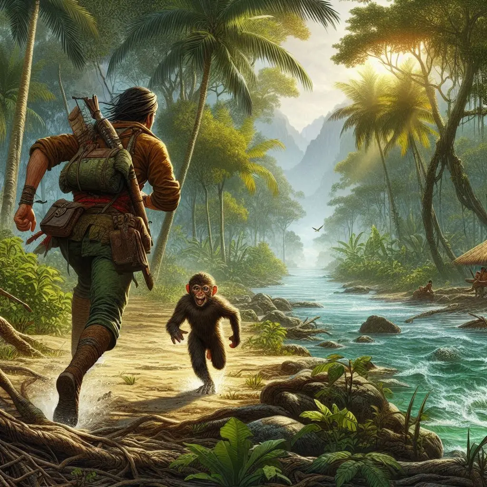
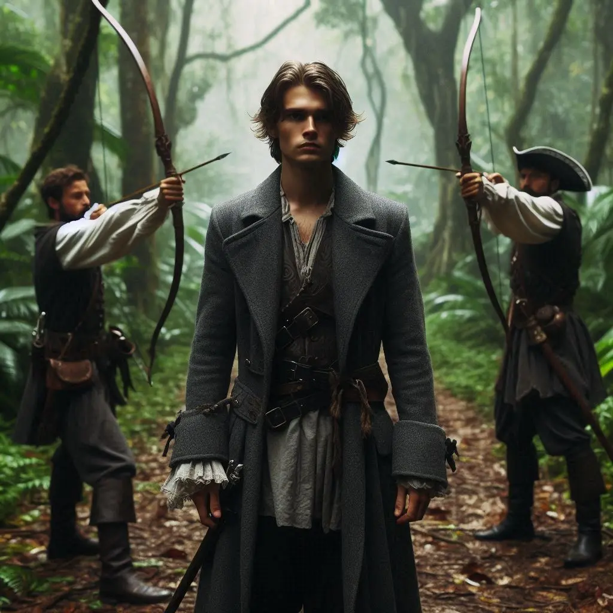
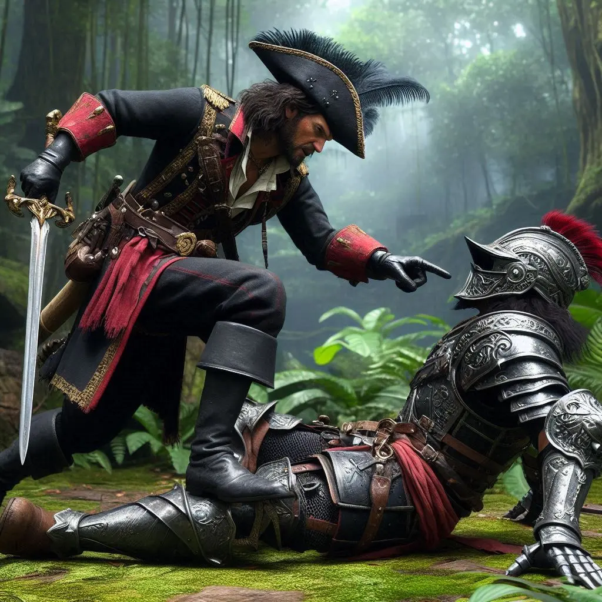
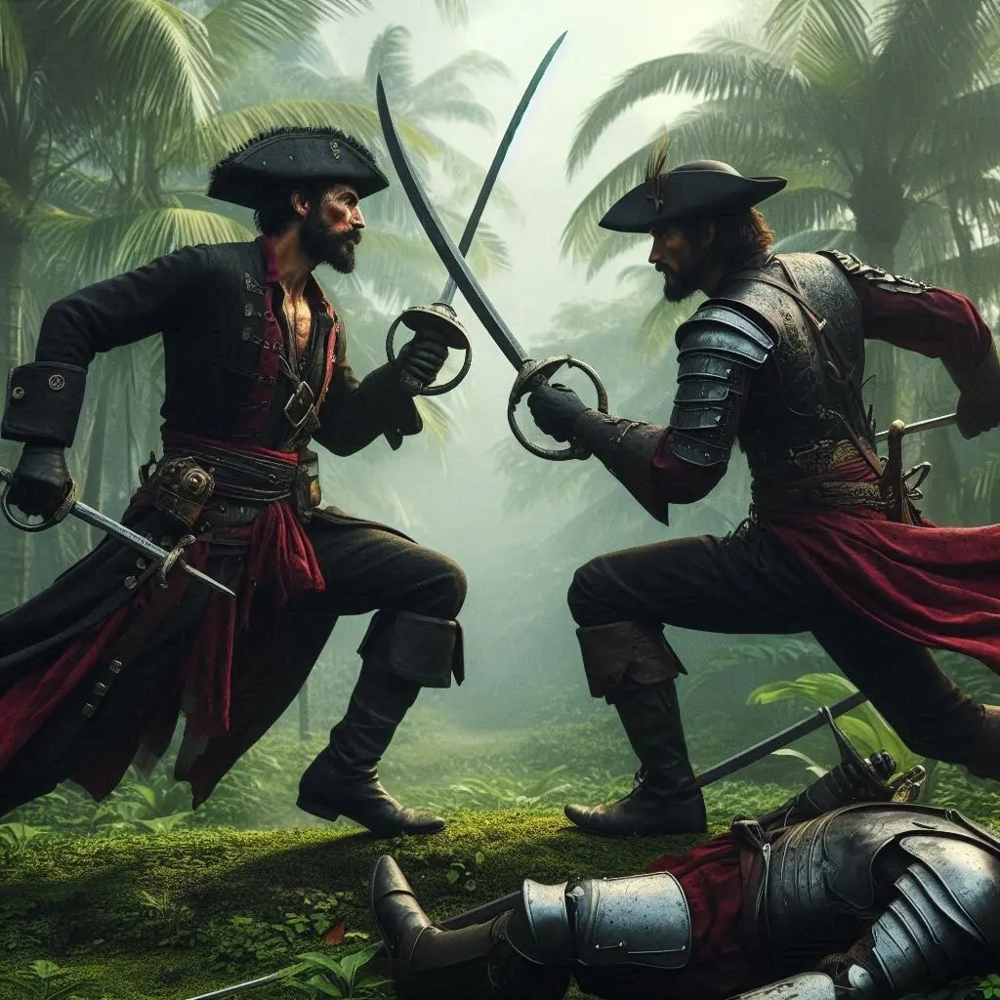

El sol del matí escombrava la penombra de la nit passada, però per a nosaltres, la seva llum no portava la llibertat. Caminàvem lligats, com presoners, amb el cap baix i el cor ple de preocupació. En Sigurd i els seus homes ens mantenien vigilats de prop.

Durant hores avançàrem en silenci, cadascú immers en els seus pensaments. Els nostres passos ressonaven sobre el camí de terra, un eco constant de la nostra incertesa. De sobte, en Sigurd va donar un senyal amb la mà. El grup es va aturar, mentre ell s’allunyava amb cinc dels seus homes. La seva absència omplia l’aire de dubtes i neguit.

Quan van tornar, anaven acompanyats d’un grup d’indígenes. En Sigurd semblava comunicar-se amb ells amb facilitat, parlant la seva llengua. Sense cap mirament, va lliurar en Kamui al cap de la tribu. Sense temps per pensar, vaig fer servir la màgia del Glamour per transformar la corda que em lligava en un ganivet afilat. Amb un tall ràpid, em vaig alliberar i vaig fugir corrents, seguint el rastre d’en Kamui. No podia permetre que el meu company fos capturat sense lluitar.

Corria sense descans. No volia mirar enrere, només avançava, impulsat per la determinació i la desesperació. De sobte, vaig sentir un soroll entre les branques. Un mico saltà dels arbres i, per la seva actitud, vaig reconèixer l’Alina en la seva nova forma animal. Junts vam continuar la persecució, avançant amb rapidesa fins que vam arribar a pocs metres dels indígenes. Sense dubtar-ho, vam atacar frontalment. La sorpresa jugava al nostre favor, i la confusió dels indígenes ens va permetre superar-los ràpidament. Amb un últim esforç, vam alliberar en Kamui i ens vam preparar per tornar amb la resta de companys.

Mentre m'allunyava, vaig sentir que en Kamui i l'Alina decidien quedar-se enrere. Jo vaig continuar el meu camí, sabent que havia complert el nostre objectiu immediat: alliberar en Kamui. Passades unes hores caminant sol, dues veus en castellà van exclamar:

—Alto! Estem apuntant amb un arc. Qui ets?

Les veus semblaven familiars. Em vaig girar i vaig cridar:

—Soc en Reiv Anvil.

Els homes eren en Johannes i altres mariners.

—Reiv! Què hi fas aquí? —preguntà en Johannes.

Els vaig descriure la nostra odissea amb sinceritat i tota mena de detalls. En Johannes, sorprès però comprensiu, em va explicar que la resta tenia un pla per prendre-li el llibre a en Sigurd, evitant una batalla a mort. Tenien la intenció de sembrar el caos perquè algú pogués trobar el llibre i, al crit de "Marxem!", sortir corrents.

Arribà el moment del xoc frontal. Diversos grups s'enfrontaven en una batalla ferotge, inclosos alguns grups d'indígenes que ara amenaçaven els homes d'en Sigurd. La situació era tant caòtica com perillosa.

Alguns dels nostres companys s'enfrontaren directament amb en Sigurd. En Kamui, confiat, va intentar atacar-lo cos a cos, però en Sigurd esquivava qualsevol intent ofensiu amb una agilitat sorprenent. Amb un sol cop, va tombar en Kamui.

De sobte, en Gunnar, lluint la jaqueta d'en Sigurd, va cridar:

—Marxem!

Tothom va escampar la boira, menys en Kamui, que jeia a terra, malferit.

—Et mataré, i em quedaré amb la teva armadura —va dir en Sigurd a en Kamui, mentre aixecava la seva espasa amb una mirada gèlida i determinant.

Amb un moviment ràpid i precís, va preparar-se per donar l'estocada final a en Kamui.

“Ksss!” L’espasa d’en Sigurd va xocar amb la d’Alarik Dantés, que va aparèixer d’entre les ombres per evitar l’execució d’en Kamui.

—T’has endut el llibre? —preguntà en Sigurd a Alarik, amb una veu carregada de tensió.

—Sí. Això s’acaba aquí —respongué Alarik.

—Quin remei —digué en Sigurd, resignat però encara amenaçador.

Els dos capitans van ordenar als seus homes aturar la batussa. Alguns companys, com la Helen o en Kelsier, van aprofitar per recuperar les seves motxilles del campament abans de fer rumb a la costa.
