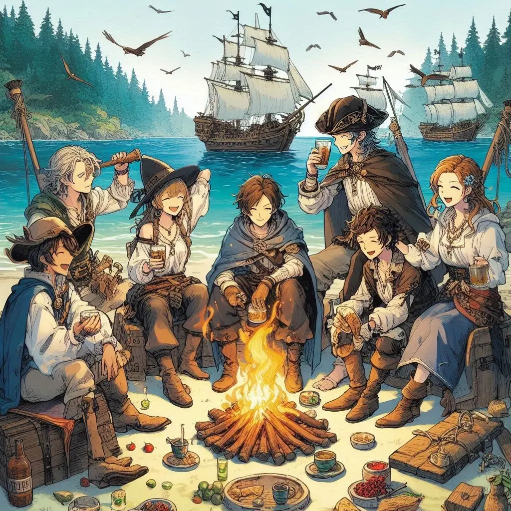
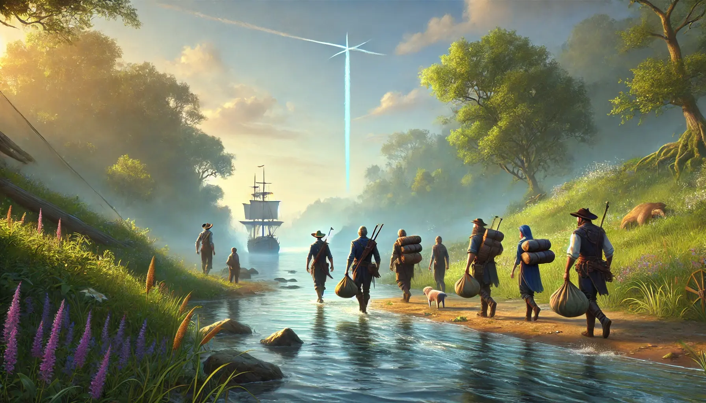
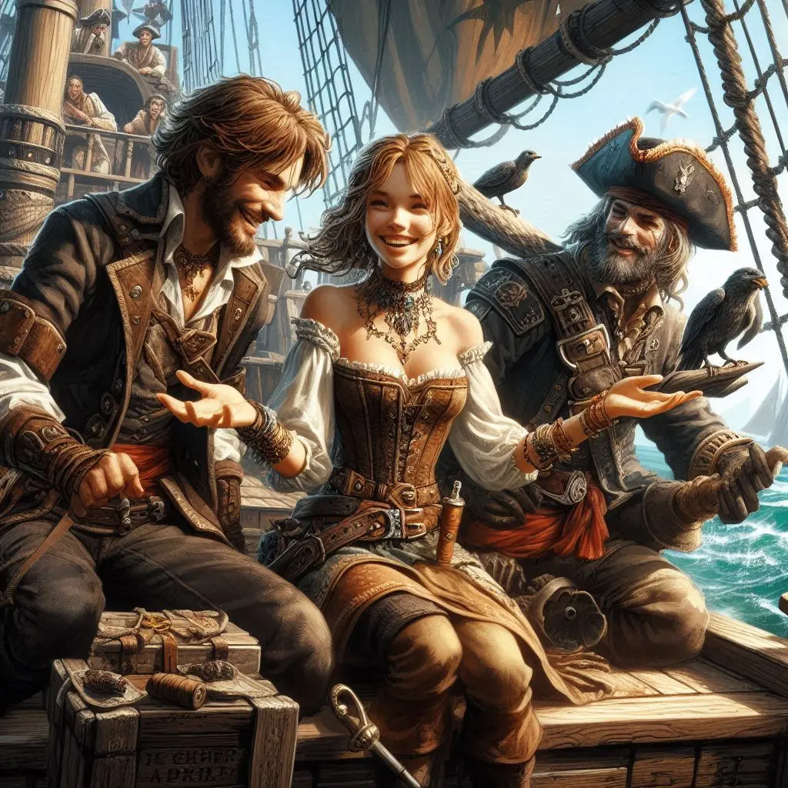

Caminàrem sense descans durant dues jornades, fent parades curtes per dormir el mínim imprescindible. Alarik es mostrava distant, introvertit, misteriós. Parlava ben poc. La resta de companys eren més oberts.

Quan arribàrem al vaixell, per fi sentírem calma i seguretat, com si ens trobéssim dins del mismíssim castell d’Alexandria. Ens assabentàrem que Alarik havia demanat a en Johannes que tornés a la cova a recuperar els tresors. Alina, amb un estrany interès—no sé ben bé si per oportunisme o per amor—ens va convèncer que no els podíem deixar anar-hi sols; els havíem d’ajudar. Helen, en canvi, va demanar passar almenys una nit tranquils, bevent rom i celebrant la tornada. Així ho vam fer. L’endemà partiríem.

El dia ens saludava amb un cel clar. Descendírem de la nau a la costa i enfilàrem riu amunt. Però les hores de caminada no foren en va. En la llunyania, una fina columna de fum blau s'alçava cap al cel com un senyal de pau: eren els nostres companys, sans i estalvis, carregant sis sacs plens de tresors. Ara sí, la nostra feina estava completa, i tots junts tornàrem al vaixell.

Un cop a bord, l'Alarik es va mostrar a la coberta per dirigir-nos unes paraules. Va felicitar-nos a tots per l'èxit de la campanya, tot i les nombroses adversitats. Però la seva solemnitat durà poc: ben aviat va ordenar posar rumb a Valdeluna, i els mariners, amb crits alegres i un somriure d'alleujament als llavis, es disposaren a complir la seva ordre.

Des del moment en què tornàrem a la nau, notàrem un canvi en els nostres companys. Hi havia una nova estima, expressada en palmades a l’esquena i comentaris d’aprovació. Tot i això, alguns no es van estar de recordar-li a l’Alina que havíem perdut un bot per una mala decisió.

—Ja ho arreglarem —va dir ella, somrient.

El viatge cap a Valdeluna es va omplir d’alegria. L’Alarik, un cop més, es va apropar a nosaltres per felicitar-nos, convidant-nos a un banquet més que merescut. En Gunnar, lluint amb orgull la jaqueta d’en Sigurd, va tornar a la consulta per aprendre medicina amb l’Alberto. L’Alina s’acostava a en Johannes i l’Alarik, potser buscant respostes, o simplement oportunitats. Helen es divertia xafardejant i sent l’ànima de la nau. Eryn tocava música a la coberta, mentre alguns mariners jugaven a daus o feien punteria amb els ganivets, gaudint d’un merescut descans.

Per uns instants, la por de les últimes setmanes es va convertir en satisfacció. La mar, que ens havia portat a l’aventura, ara ens conduïa de tornada a casa.
