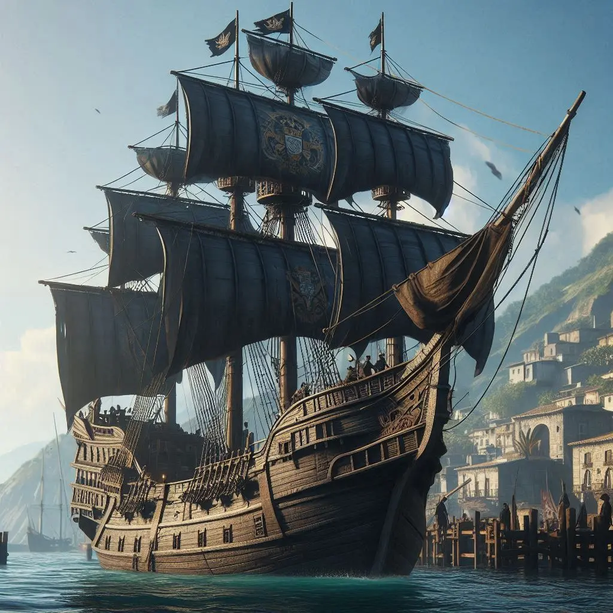
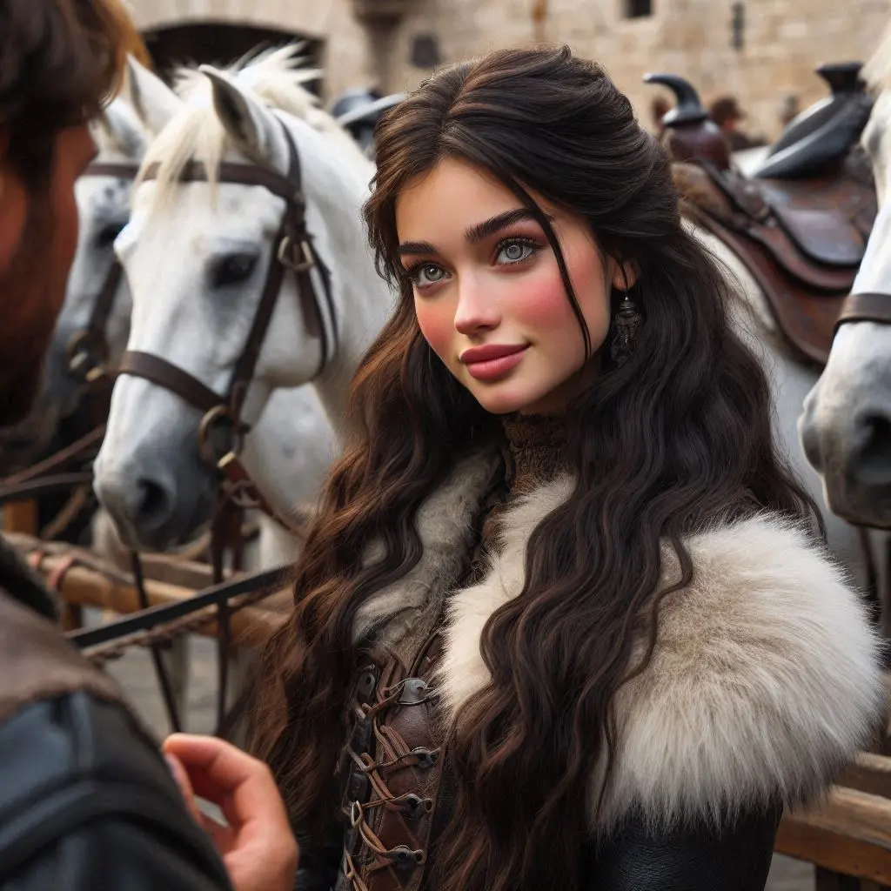
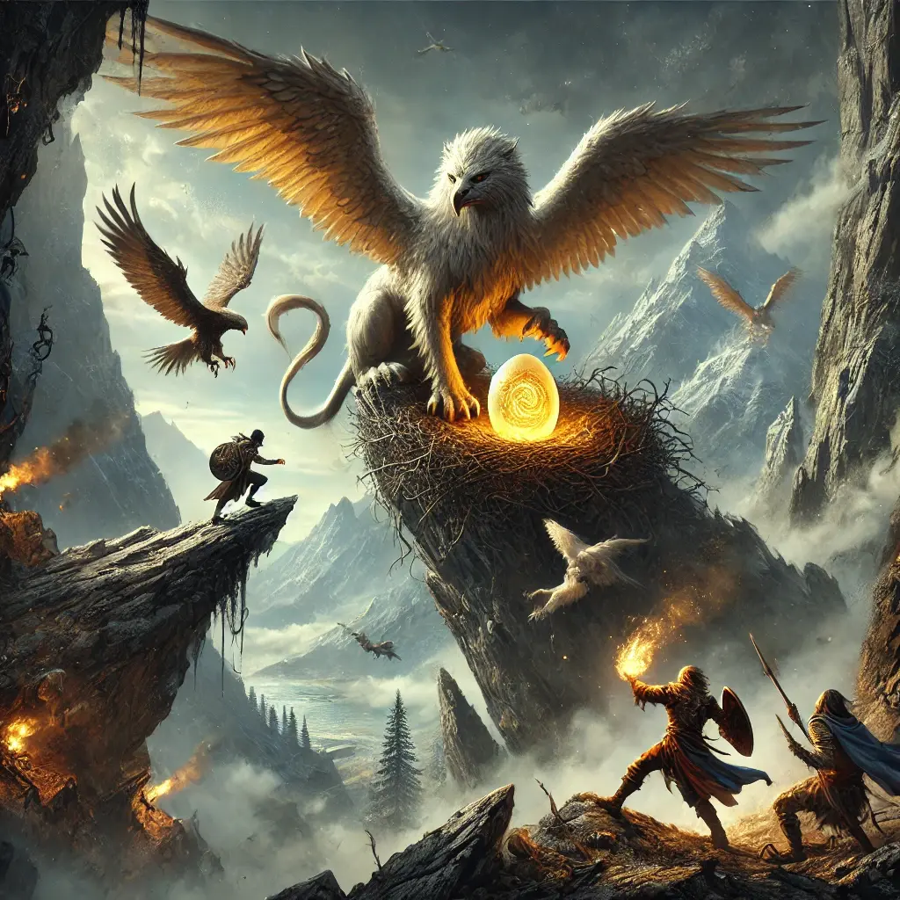

L'endemà, el Corazón Sombrío va atracar al port de Valdeluna sota un sol radiant. Les veles es desinflaren amb un sospir, i la tripulació va ser convidada a descansar mentre es taxaven els tresors i es preparava la pròxima expedició. Nosaltres, però, no tindríem gaire repòs: en Johannes ens va encarregar una nova missió. Un grifó havia fet niu als afores del poble, i la seva presència inquietava els veïns. Havíem de destruir el niu.

Sense perdre temps, cadascú es va dispersar pel poble per atendre els seus afers. La meva primera parada fou el Tresor de Valdeluna, on, casualment, tots els nobles ens trobàrem per obrir comptes per a les nostres cases. També hi havia en Gunnar, que semblava comptar amb algun tipus de mecenatge.

Al banc, la senyoreta Thomson ens va rebre amb la cortesia pròpia del seu càrrec i ens va demanar que ens identifiquéssim presentant els nostres emblemes nobiliaris: la Helen mostrà el seu tatuatge a l’avantbraç, en Kamui el duia forjat a l’armadura Dracheneisen, en Kelsier exhibí el seu braçalet d’or, adornat amb metalls i pedres precioses, i jo vaig mostrar l’anell de la llàgrima Frostwind. A continuació, el director ens va atendre individualment al seu despatx.

Mentrestant, el poble bullia d'activitat i ens dispersàrem. En Kamui visità la casa del llenyataire, oferint-se a treballar a canvi d'allotjament. L'Alina explorava el mercat, intentant seduir els comerciants de cavalls. Acabà amb una cita i un descompte poc convincent: de 3000 a 2400 gremials. Tanmateix, ella no tenia ni un duro. La Helen tornà a la casa de José, on fou ben rebuda i convidada a passar la nit. En Gunnar es dirigí al doctor Alberto, oferint-se a fer pràctiques a canvi d'allotjament. Jo vaig anar a El Pony Pisador per preguntar a en José si coneixia algú que tingués una casa en venda o lloguer; ell em digué que ho indagaria. Després, al Kraken, en Miguel Tiño em comentà que coneixia algú i que concertaria una cita per a l'endemà al migdia.

A poc a poc, ens anàrem reunint amb els companys, i vaig aprofitar l'ocasió per preguntar als clients què sabien sobre el Grifó. Tots confirmaren haver sentit parlar dels problemes que havia causat aquella criatura. Un client ens informà que alguns pagesos de la zona de granges havien reportat la mort d'algunes bestioles i la desaparició, probablement mortal, d'un treballador.

Ens apropem a la zona per verificar la informació. Allí trobem un dels pagesos encara treballant. M'hi dirigeixo amb educació i sembla que li caic bé. És un bon home, tot i que no massa espavilat. Després de parlar una bona estona, li confirmo que l'endemà començaríem a buscar el seu company i el niu del Grifó. Ens ho agraeix sincerament.

L'endemà, partírem cap a l'oest a la recerca del Grifó. L'Alina aconseguí dos cavalls prestats d'en Johannes. Pel camí, ens topàrem amb un grup d'aventurers anglesos, poc destres, que estaven cercant un os que també causava estralls entre els veïns de la zona. Decidírem caminar junts.

Després d'una llarga jornada, arribà el moment de fer nit. Compartírem les guàrdies entre els dos grups. Durant la meva ronda, en Jameson, visiblement afectat, em confessà amb tristesa que havia enterrat dues persones estimades pels atacs de l'os. La seva pena era profunda. Li vaig explicar que el poble també patia sota l'amenaça del Grifó i li vaig prometre que acabaríem amb l'os, el Grifó i qualsevol altra bèstia que gosés amenaçar innocents.

A primera hora del matí, ens posàrem en marxa. Els companys d'en Jameson asseguraren haver trobat un rastre, i començàrem a seguir-lo amb cautela. Els senyals a terra indicaven que la bèstia havia passat per allí feia poc. En Gunnar no semblava gaire convençut de la prioritat d'aquella cacera, però continuàrem fins que uns crits trencaren la tranquil·litat del bosc. De cop, tres persones aparegueren fugint d'una ombra massiva que es movia amb una agilitat inquietant. L'os sorgí d'entre els arbres, rugint amb fúria, els ulls injectats de sang.

Amb un impuls de valentia, m'interposí al seu camí, intentant clavar-li una estocada directa al flanc. Però l'os, més àgil del que m'esperava, esquivà l'atac amb un salt lateral sorprenent. La meva acció, tanmateix, inspirà la resta del grup, i ens llançàrem en un atac coordinat, encerclant la criatura. L'os lluità amb una ferocitat indomable, les seves urpes tallant l'aire com fulles d'una guillotina. Rresultà ser un adversari formidable, fort, àgil i hàbil en combat. Tanmateix, no pogué resistir l'embat del grup.

Després d’un combat ferotge, aconseguírem ferir-lo greument. En Jameson, consumit per la ràbia i el dolor, s'abalançà sobre la bèstia i la rematà amb múltiples punyalades, cada cop carregat d'una fúria visceral. Alguns membres del grup arrencaren urpes com a trofeus. Jo, pensant en la nostra residència, decidí quedar-me amb el cap de l’os, ja imaginant-lo penjat a la paret del nostre futur saló principal.

El grup d’anglesos quedà molt malferit. En Gunnar s’encarregà de les primeres cures, i els ferits decidiren retornar a Valdeluna per descansar i acabar de sanar les seves ferides. Els deixàrem un dels cavalls que havíem agafat en préstec de la granja, recordant-los que l’havien de retornar abans de marxar. No obstant això, en Jameson complí la seva promesa i ens acompanyà a resoldre el niu del Grifó.

Arribàrem a una muntanya i decidírem guaitar des d'un punt elevat per obtenir una millor visió del terreny. Mentre la resta del grup s’amagava entre les roques, vaig decidir avançar sol cap a un clar elevat per atraure l’atenció del Grifó.

Passada una estona, el vaig veure volant en cercles sobre meu, analitzant cada moviment. Aterrà sobre una roca una mica més elevada que jo, a uns dos-cents metres de distància, les seves urpes es clavaren a la pedra mentre ens observava amb ulls plens de desconfiança.

Intentàrem provocar-lo, fent moviments bruscs i cridant, però el Grifó, amb una elegància gairebé sobrenatural, tornà a alçar el vol i desaparegué dins el bosc. Sense perdre temps, el vam seguir a cavall, en una persecució frenètica a través de la vegetació espessa.

Finalment, després d’una llarga cursa, arribàrem a una clariana on el vam trobar defensant ferotgement el seu niu, amb les ales mig esteses i una mirada amenaçadora que ens advertia que no féssim un pas més.

Mentre la resta es perdien en discussions sobre com localitzar-lo, en Kamui i jo decidírem actuar. Ens llençàrem en un atac frontal sense vacil·lar. Aquesta vegada, el Grifó no fugí. Al contrari, es mostrà encara més ferotge, adoptant una actitud completament defensiva. La seva força i agilitat superaven fins i tot les de l'os: esquivava gairebé tots els nostres atacs amb destresa, i les seves urpes no fallaven. Cada enfrontament amb ell era més intens que l'anterior, fent-nos veure que no ens enfrontàvem a un simple animal, sinó a un adversari llegendari.

Mentre en Kamui i jo l’enfrontàvem, la Helen, en Cedric i en Gunnar escalaren per trobar el niu. La pujada era costeruda, amb la roca esmolada i relliscosa sota els seus peus. En arribar al cim, descobriren un segon Grifó, la femella, que protegia amb zel un únic ou d’un blanc nacrat amb reflexos daurats. La criatura, amb les ales mig esteses i les urpes clavades a la pedra, emetia un gruny profund d’advertència.

Helen, astuta, usà el seu Glamour per transformar l’ou en un simple botó, que s’amagà amb destresa a la seva bossa. Alhora, en Gunnar, amb la seva determinació implacable, calà foc al niu amb una torxa improvisada. Les flames s’alçaren ràpidament, el fum ennegrí l’aire i la femella emeté un crit esquinçador, ple de desesperació i ràbia.

El caos esclatà en un instant. Els Grifons, embogits per la pèrdua del niu, ens atacaren amb una fúria incontrolable. El mascle redoblà la seva agressivitat, atacant-nos amb una força devastadora, mentre la femella descendia furiosa cap a Helen i Gunnar.

Després d’un combat esgotador, vam decidir fugir, però els Grifons ens perseguiren implacablement. Un d’ells atrapà en Gunnar i el sacsejà amb violència en un intent desesperat de recuperar l’ou. Sense trobar-ne rastre, el deixà caure amb fúria i es girà cap a Helen, els seus ulls plens d’ira. Veient-se atrapada, Helen no tingué més remei que desfer l’encanteri i deixar l’ou a terra. Els Grifons, en un instant, oblidaren la nostra presència. La femella s’abalançà sobre el seu tresor recuperat, i amb un últim esguard carregat de ressentiment, les criatures s’enlairaren i desaparegueren en l’horitzó.
