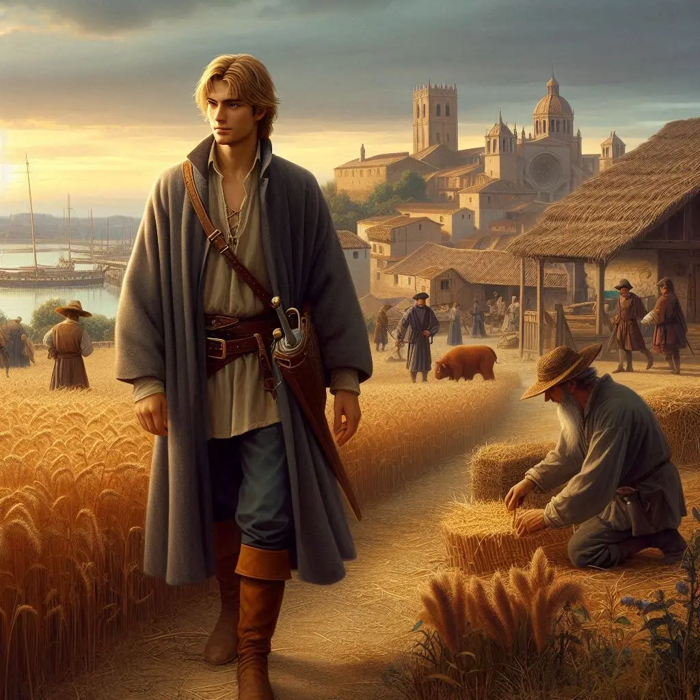
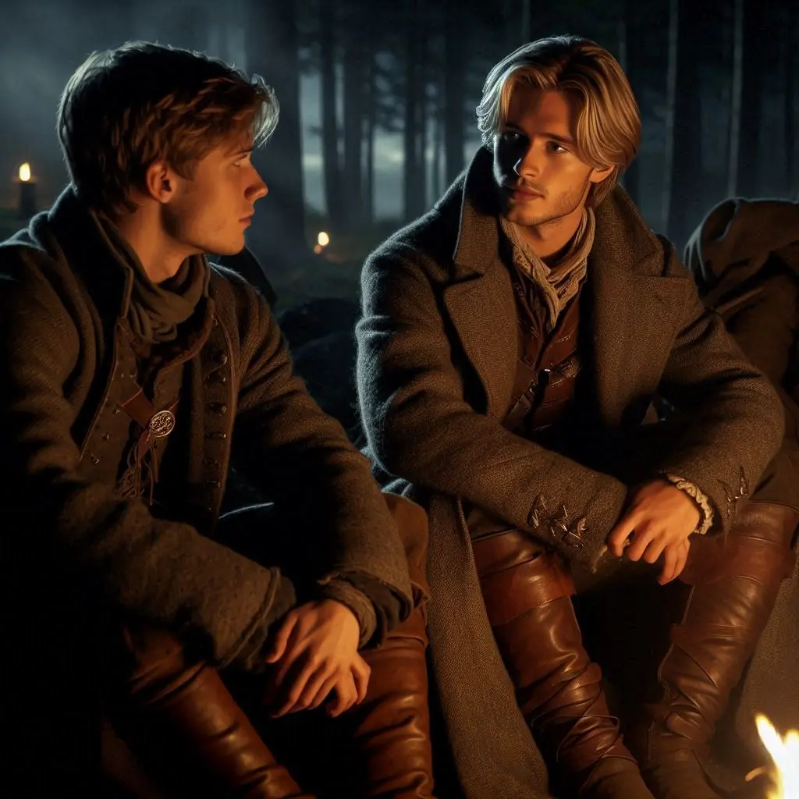
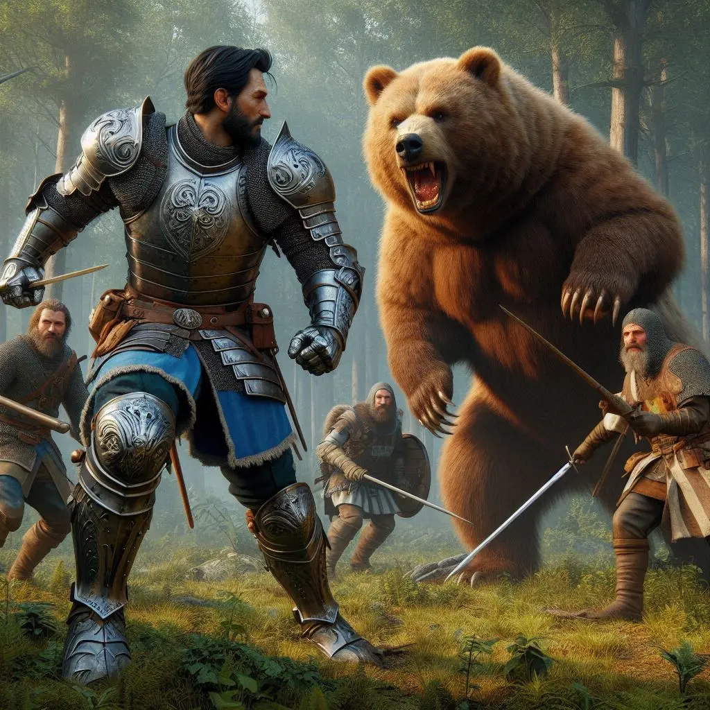

A poc a poc, ens anàrem reunint amb els companys, i vaig aprofitar l'ocasió per preguntar als clients què sabien sobre el Grifó. Tots confirmaren haver sentit parlar dels problemes que havia causat aquella criatura. Un client ens informà que alguns pagesos de la zona de granges havien reportat la mort d'algunes bestioles i la desaparició, probablement mortal, d'un treballador.

Ens apropem a la zona per verificar la informació. Allí trobem un dels pagesos encara treballant. M'hi dirigeixo amb educació i sembla que li caic bé. És un bon home, tot i que no massa espavilat. Després de parlar una bona estona, li confirmo que l'endemà començaríem a buscar el seu company i el niu del Grifó. Ens ho agraeix sincerament.

L'endemà, partírem cap a l'oest a la recerca del Grifó. L'Alina aconseguí dos cavalls prestats d'en Johannes. Pel camí, ens topàrem amb un grup d'aventurers anglesos, poc destres, que estaven cercant un os que també causava estralls entre els veïns de la zona. Decidírem caminar junts.

Després d'una llarga jornada, arribà el moment de fer nit. Compartírem les guàrdies entre els dos grups. Durant la meva ronda, en Jameson, visiblement afectat, em confessà amb tristesa que havia enterrat dues persones estimades pels atacs de l'os. La seva pena era profunda. Li vaig explicar que el poble també patia sota l'amenaça del Grifó i li vaig prometre que acabaríem amb l'os, el Grifó i qualsevol altra bèstia que gosés amenaçar innocents.

A primera hora del matí, ens posàrem en marxa. Els companys d'en Jameson asseguraren haver trobat un rastre, i començàrem a seguir-lo amb cautela. Els senyals a terra indicaven que la bèstia havia passat per allí feia poc. En Gunnar no semblava gaire convençut de la prioritat d'aquella cacera, però continuàrem fins que uns crits trencaren la tranquil·litat del bosc. De cop, tres persones aparegueren fugint d'una ombra massiva que es movia amb una agilitat inquietant. L'os sorgí d'entre els arbres, rugint amb fúria, els ulls injectats de sang.

Amb un impuls de valentia, m'interposí al seu camí, intentant clavar-li una estocada directa al flanc. Però l'os, més àgil del que m'esperava, esquivà l'atac amb un salt lateral sorprenent. La meva acció, tanmateix, inspirà la resta del grup, i ens llançàrem en un atac coordinat, encerclant la criatura. L'os lluità amb una ferocitat indomable, les seves urpes tallant l'aire com fulles d'una guillotina. Rresultà ser un adversari formidable, fort, àgil i hàbil en combat. Tanmateix, no pogué resistir l'embat del grup.

Després d’un combat ferotge, aconseguírem ferir-lo greument. En Jameson, consumit per la ràbia i el dolor, s'abalançà sobre la bèstia i la rematà amb múltiples punyalades, cada cop carregat d'una fúria visceral. Alguns membres del grup arrencaren urpes com a trofeus. Jo, pensant en la nostra residència, decidí quedar-me amb el cap de l’os, ja imaginant-lo penjat a la paret del nostre futur saló principal.

El grup d’anglesos quedà molt malferit. En Gunnar s’encarregà de les primeres cures, i els ferits decidiren retornar a Valdeluna per descansar i acabar de sanar les seves ferides. Els deixàrem un dels cavalls que havíem agafat en préstec de la granja, recordant-los que l’havien de retornar abans de marxar. No obstant això, en Jameson complí la seva promesa i ens acompanyà a resoldre el niu del Grifó.

