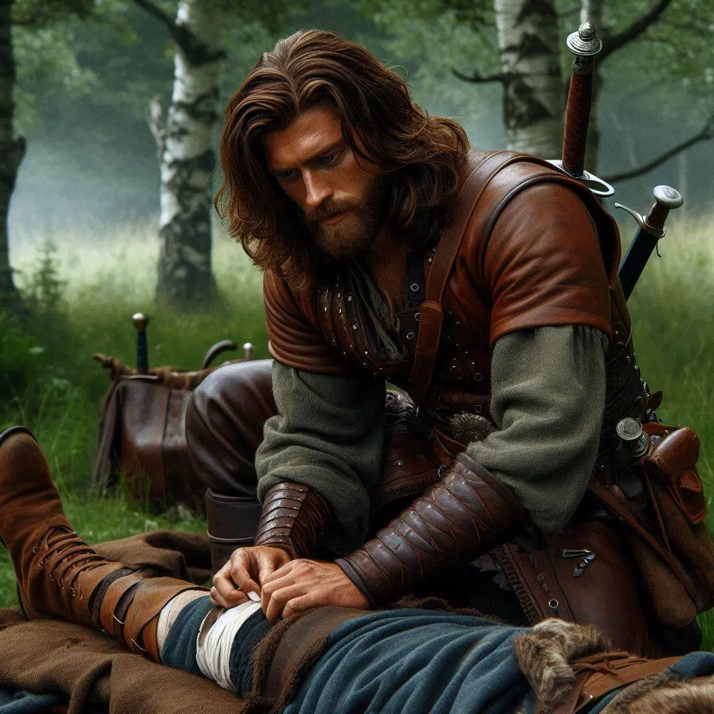
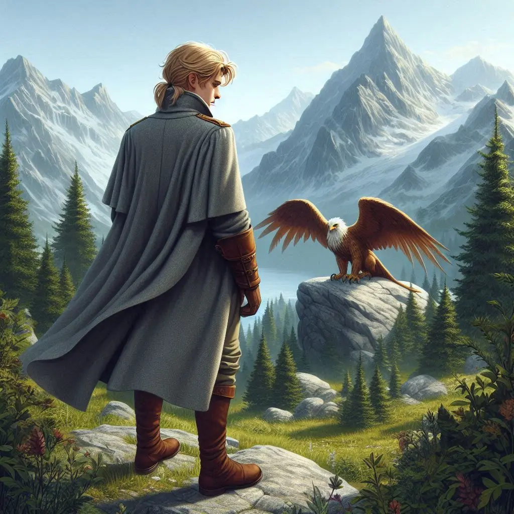
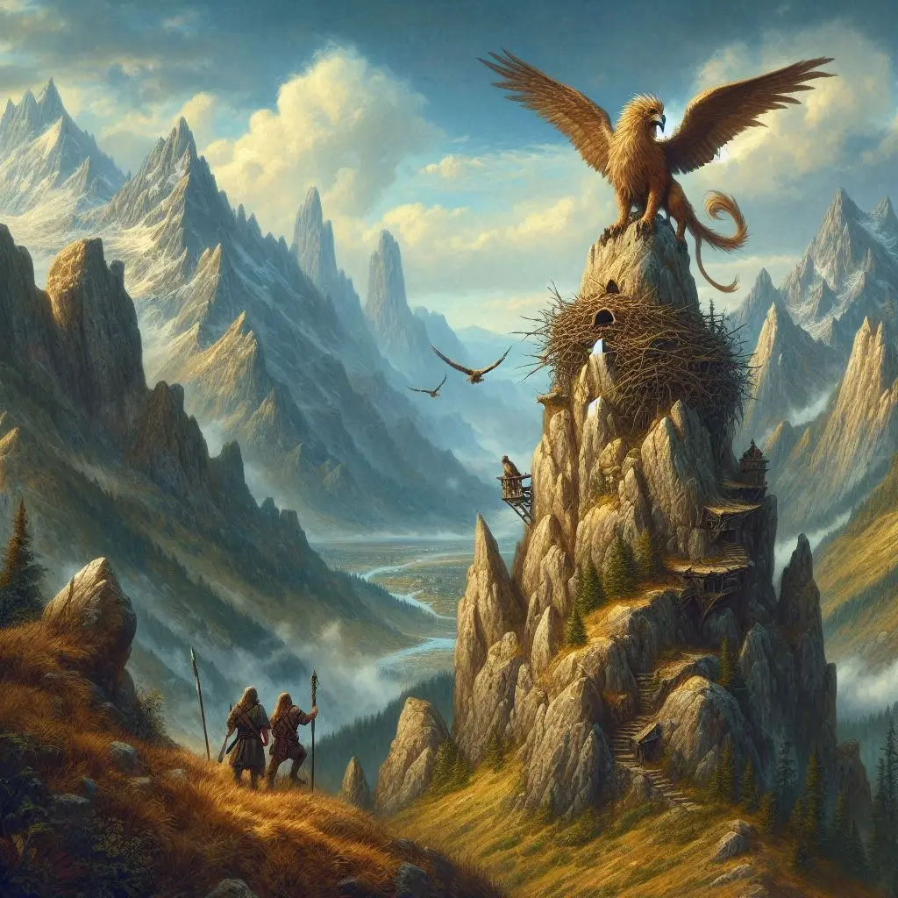

Arribàrem a una muntanya i decidírem guaitar des d'un punt elevat per obtenir una millor visió del terreny. Mentre la resta del grup s’amagava entre les roques, vaig decidir avançar sol cap a un clar elevat per atraure l’atenció del Grifó.

Passada una estona, el vaig veure volant en cercles sobre meu, analitzant cada moviment. Aterrà sobre una roca una mica més elevada que jo, a uns dos-cents metres de distància, les seves urpes es clavaren a la pedra mentre ens observava amb ulls plens de desconfiança.

Intentàrem provocar-lo, fent moviments bruscs i cridant, però el Grifó, amb una elegància gairebé sobrenatural, tornà a alçar el vol i desaparegué dins el bosc. Sense perdre temps, el vam seguir a cavall, en una persecució frenètica a través de la vegetació espessa.

Finalment, després d’una llarga cursa, arribàrem a una clariana on el vam trobar defensant ferotgement el seu niu, amb les ales mig esteses i una mirada amenaçadora que ens advertia que no féssim un pas més.

Mentre la resta es perdien en discussions sobre com localitzar-lo, en Kamui i jo decidírem actuar. Ens llençàrem en un atac frontal sense vacil·lar. Aquesta vegada, el Grifó no fugí. Al contrari, es mostrà encara més ferotge, adoptant una actitud completament defensiva. La seva força i agilitat superaven fins i tot les de l'os: esquivava gairebé tots els nostres atacs amb destresa, i les seves urpes no fallaven. Cada enfrontament amb ell era més intens que l'anterior, fent-nos veure que no ens enfrontàvem a un simple animal, sinó a un adversari llegendari.

Mentre en Kamui i jo l’enfrontàvem, la Helen, en Cedric i en Gunnar escalaren per trobar el niu. La pujada era costeruda, amb la roca esmolada i relliscosa sota els seus peus. En arribar al cim, descobriren un segon Grifó, la femella, que protegia amb zel un únic ou d’un blanc nacrat amb reflexos daurats. La criatura, amb les ales mig esteses i les urpes clavades a la pedra, emetia un gruny profund d’advertència.

Helen, astuta, usà el seu Glamour per transformar l’ou en un simple botó, que s’amagà amb destresa a la seva bossa. Alhora, en Gunnar, amb la seva determinació implacable, calà foc al niu amb una torxa improvisada. Les flames s’alçaren ràpidament, el fum ennegrí l’aire i la femella emeté un crit esquinçador, ple de desesperació i ràbia.

El caos esclatà en un instant. Els Grifons, embogits per la pèrdua del niu, ens atacaren amb una fúria incontrolable. El mascle redoblà la seva agressivitat, atacant-nos amb una força devastadora, mentre la femella descendia furiosa cap a Helen i Gunnar.

Després d’un combat esgotador, vam decidir fugir, però els Grifons ens perseguiren implacablement. Un d’ells atrapà en Gunnar i el sacsejà amb violència en un intent desesperat de recuperar l’ou. Sense trobar-ne rastre, el deixà caure amb fúria i es girà cap a Helen, els seus ulls plens d’ira. Veient-se atrapada, Helen no tingué més remei que desfer l’encanteri i deixar l’ou a terra. Els Grifons, en un instant, oblidaren la nostra presència. La femella s’abalançà sobre el seu tresor recuperat, i amb un últim esguard carregat de ressentiment, les criatures s’enlairaren i desaparegueren en l’horitzó.
