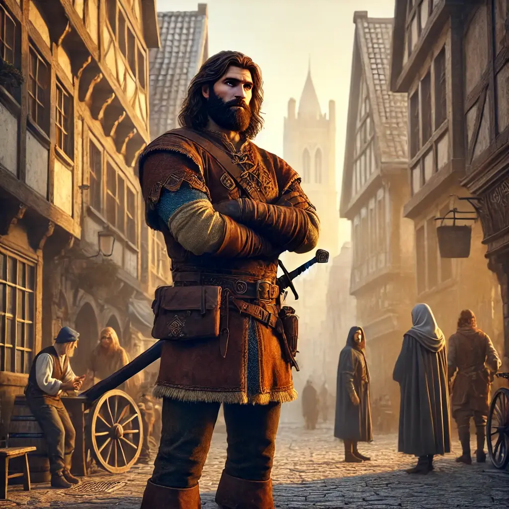
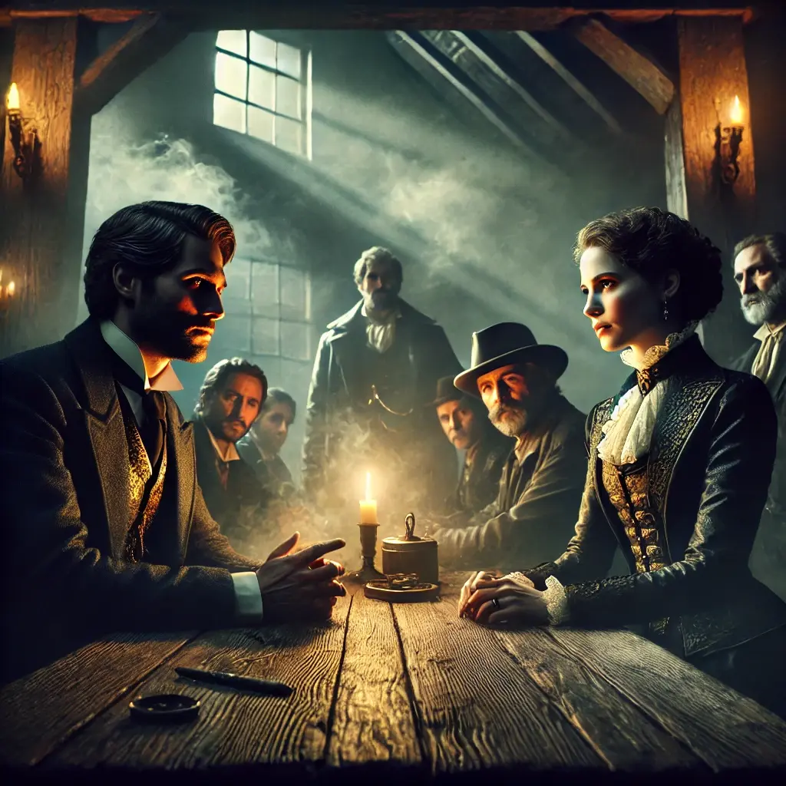
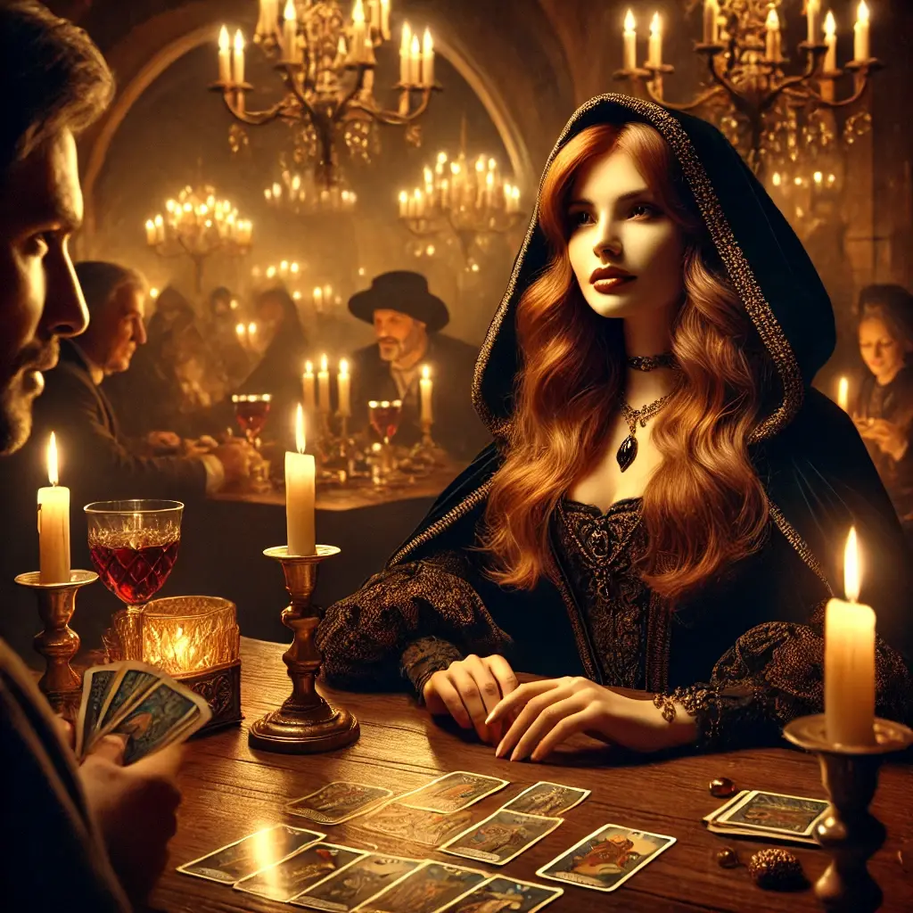
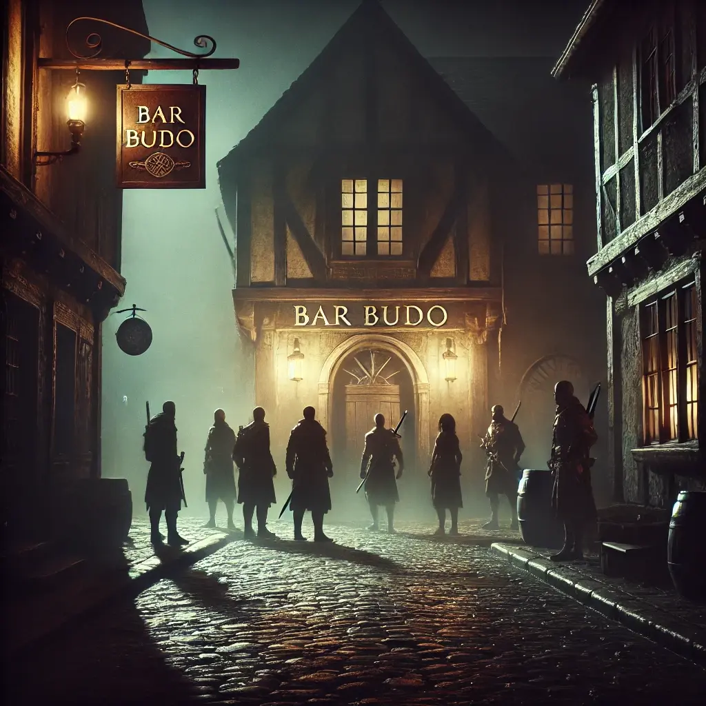
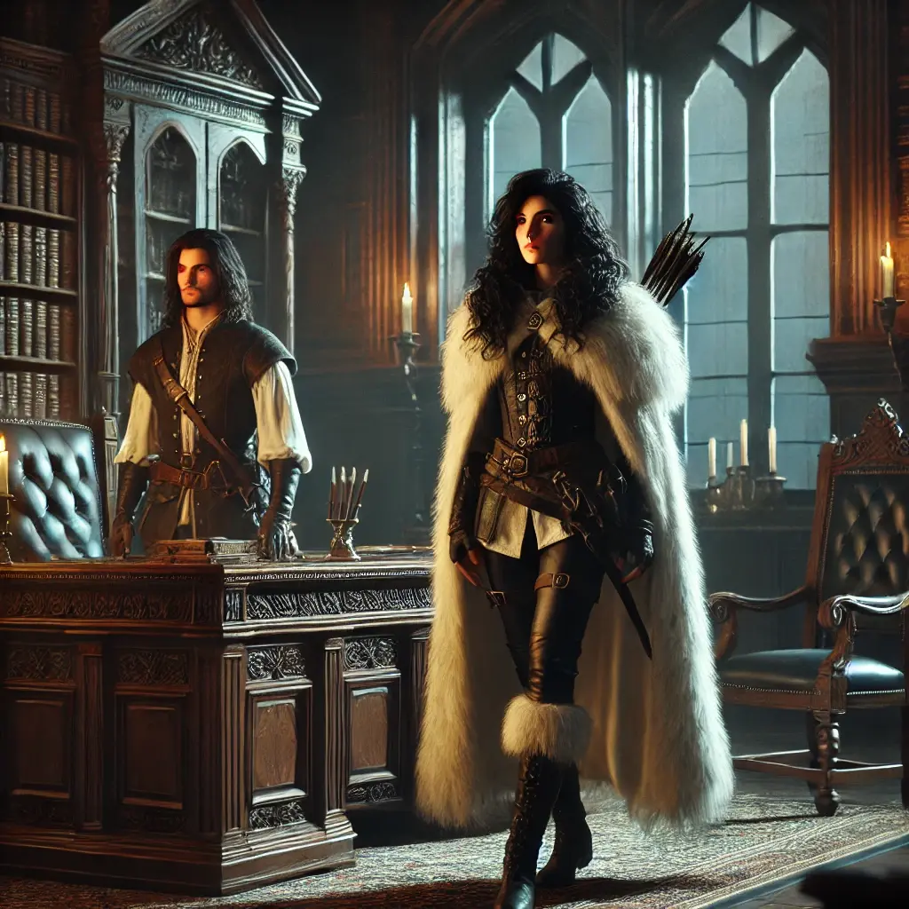

L’endemà al matí, el sol lluïa amb una claror ingènua que contrastava amb les ombres que s’allargaven sobre Magerit. La nostra trobada amb en Kinnehan era imminent, però en Gunnar es negava rotundament a entrar desarmat i en desigualtat de condicions. La seva desconfiança era justificada, i tots compartíem la sensació que aquella aliança era tan inestable com una espasa sobre un fil de seda.

Decidírem adoptar una estratègia prudent. Alina i Eryn entraren primer a l’establiment per esmorzar. Elles no eren cares conegudes per la màfia, així que podrien vigilar la situació des de dins sense aixecar sospites. Jo, en canvi, em vaig endinsar en solitari cap a la reunió amb en Thomas Kinnehan. Els seus homes m’observaren amb ulls gèlids quan vaig travessar la sala, però ell m’esperava amb una expressió de calculada paciència. Li exposí la nostra situació i les reticències d’en Gunnar. Amb un somriure sec, en Kinnehan es posà dempeus i sortí a buscar-los en persona. Quan retornà, en Gunnar i la resta l’acompanyaven, finalment convençuts que no hi havia trampa, o si més no, que la trampa no es tancaria de seguida.

Durant la conversa, la Helen prengué la iniciativa i, amb un gest sincer, es decidí a compartir tot el que sabíem i buscàvem. En Kinnehan, lluny de molestar-se, es mostrà intrigat. Va escoltar amb interès cada paraula, amb els dits tamborinant sobre la taula de fusta massissa. Quan la Helen acabà de parlar, un lleu somriure es dibuixà als seus llavis.

—Us faré una oferta —digué, recollint la seva copa i observant el líquid daurat amb deteniment—. Atemptarem junts contra l’ajuntament. Us donaré els plànols que cerqueu i ens endurem la culpa de l’atac. Però hi ha una condició: en el moment que tingueu els plànols, desapareixereu de Magerit.

Ens miràrem entre nosaltres, valorant les implicacions d’aquell tracte. No era ideal, però tampoc teníem massa alternatives. Finalment, assentírem.

Per a la incursió a l’ajuntament, en Kinnehan ens exposà dues opcions. El primer consistia a entrar per una finestra del darrere, que un dels seus homes infiltrats deixaria oberta. Una vegada dins, hauríem d’eliminar cinc guàrdies i fer esclatar la caixa forta per aconseguir els plànols. El segon, més agressiu, consistia en eliminar tots els guàrdies de l’ajuntament i els voltants per poder robar la caixa forta amb més calma.

La decisió no fou difícil. Optàrem pel primer pla, més discret i amb menys vessament de sang innecessari. Per a l’operació, ens dividírem en dos grups de quatre persones. Alina decidí anar amb en Kinnehan per vigilar-lo de prop i assegurar-se que no ens trairia en l’últim moment. Abans de marxar, fixàrem el punt de trobada: l’endemà a les onze de la nit al bar Budo.

Durant el matí següent, mentre alguns de nosaltres ens preparàvem per l’assalt, Antonella i Kamui es dirigiren al dinar que tenien pendent amb els germans Pino per parlar de negocis, al Tres Reyes. El vi s’abocava amb una lentitud calculada i els plats arribaven amb una meticulosa presentació.

Kamui, amb la seva presència imponent, intentà conduir la conversa cap al negoci del rom, però els germans Pino es mostraren esquius i reservats. No deixaven escapar informació compromesa, i semblava que la trobada no els duria enlloc.

Antonella veié l’oportunitat d’enfocar la situació d’una altra manera. Amb un somriure enigmàtic, s’oferí a tirar les cartes a un dels germans que acceptà, potser per curiositat o per simple entreteniment. Quan la primera carta es girà sobre la taula, els seus ulls s’obriren lleument, i la respiració es féu més pausada. Antonella detectà en ell un canvi subtil, una obertura inesperada.

Les cartes revelaren que els germans Pino estaven implicats en el negoci del rom de l’alcalde. Impressionats per l’encert d’Antonella, acabaren cedint i convidaren Kamui el dimarts següent per parlar amb l’alcalde, qui en aquells moments es trobava fora de la ciutat. Amb aquesta nova informació, Antonella i Kamui abandonaren el restaurant. Havien trobat una possible escletxa per infiltrar-se en els negocis de l’alcalde.

Quan caigué la nit, el grup es reuní davant el bar Budo, disposat a iniciar l’atemptat.

Fora del mur, dues parelles de guàrdies vigilaven l’entrada de l’ajuntament, inconscients del perill imminent. Amb moviments precisos i coordinats, cada grup s’encarregà d’eliminar una parella de manera sigil·losa, evitant aixecar cap sospita. Un cop neutralitzats, ens apropàrem a la finestra del darrere, que, tal com havia promès en Kinnehan, restava oberta, donant accés directe al despatx de l’ajuntament.

Però la sort ens jugà una mala passada. En intentar enfilar-se, Kamui féu massa soroll, alertant un dels guàrdies apostats a la porta. Aquest obrí de cop i entrà al despatx, però Kamui, sense dubtar-ho, li disparà a boca de canó, destrossant-li el crani en un instant. El segon guàrdia, testimoni de la brutal execució, sortí corrent per donar la veu d’alarma. Alina disparà per aturar-lo, però errà el tret. Gunnar aconseguí ferir-lo, però fou Helen qui, amb una puntada de peu calculada, el féu rodolar escales avall. El cop final contra la pedra posà fi a la seva fugida.

Mentrestant, Kinnehan aprofità la confusió per fer esclatar la caixa forta. El fum i l’olor de pólvora ompliren l’estança mentre ell omplia ràpidament una bossa amb els documents. Alina, veient la situació, es transformà en gat i, aprofitant la densitat del fum, saltà per la finestra per seguir-lo sense ser detectada. Antonella intentà fer el mateix, però aterrà malament i es torçà el turmell. Kamui, que saltà just després, no tingué més sort: caigué com un pes mort i es també es torçà el peu.

Ens vam donar una hora per reagrupar-nos al Budo. En aquell temps, Gunnar es dirigí a una taverna qualsevol per gaudir d’un plat de cigrons fumejant, assaborint un moment de calma després de la tempesta. Kamui, tot i el dolor, optà per passejar tranquil·lament pels carrers de Magerit, la seva figura coixejant es fonia entre les ombres. Helen i Antonella, per la seva banda, aprofitaren per recuperar forces amb dues bones hidromels, la dolçor del licor alleujant la tensió del combat. Mentrestant, Alina seguia Kinnehan en la distància, amb els ulls fixos en cada moviment del mafiós. Però semblava que era un home de paraula: sense desviacions, es dirigí directament cap al Budo.

Un cop al bar Budo, en Bruto interpel·là Kinnehan amb la mirada inquisitiva.

—On és el botí? —preguntà amb un to sec.

Kinnehan, impassible, col·locà la bossa sobre la taula però no la va obrir immediatament.

—Esperarem que arribin tots —respongué amb calma.

Quan la resta del grup va arribar, Kinnehan abocà el contingut de la bossa sobre la taula. Documents i mapes es desplegaren davant nostre, però només calgué un cop d’ull per adonar-nos que allò no era el que buscàvem. En Kinnehan fullejà els papers amb la cella arrufada.

—Només hi ha dos plànols —remugà, visiblement decebut.

Els nostres cors es van enfonsar. Els documents consistien en un mapa de les inundacions de la ciutat i un altre de rutes marítimes. Res que pogués ser útil per a la nostra missió, res que pogués satisfer les demandes d’Alarick. Ens haviem jugat la vida per informació que no ens servia de res.

Un silenci espès s’instal·là entre nosaltres mentre ens miràvem amb expressions de desconcert i frustració. En aquell moment, el pes de la incertesa ens va caure a sobre com un mur de pedra. Què faríem ara?
