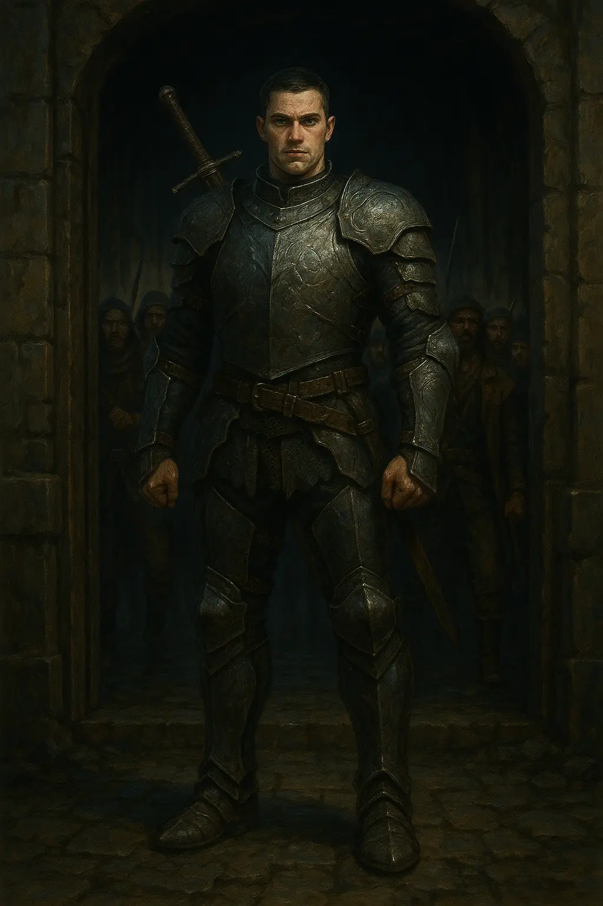
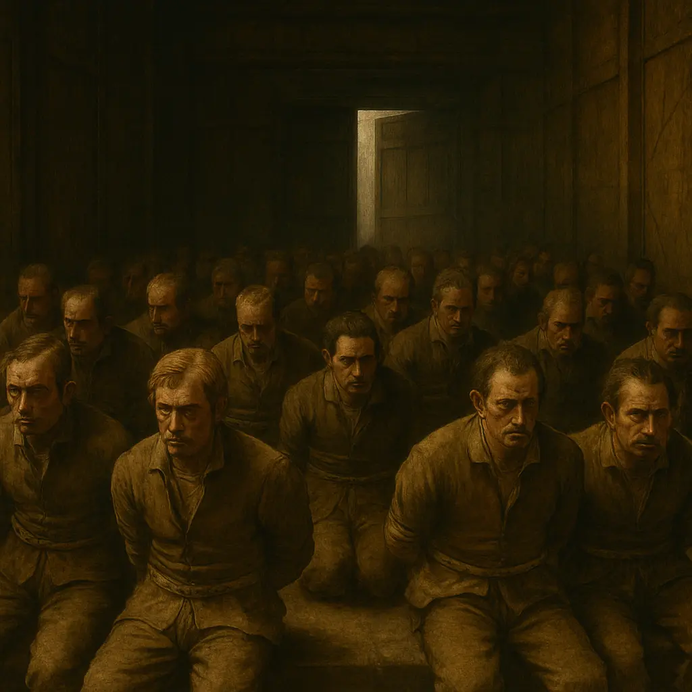
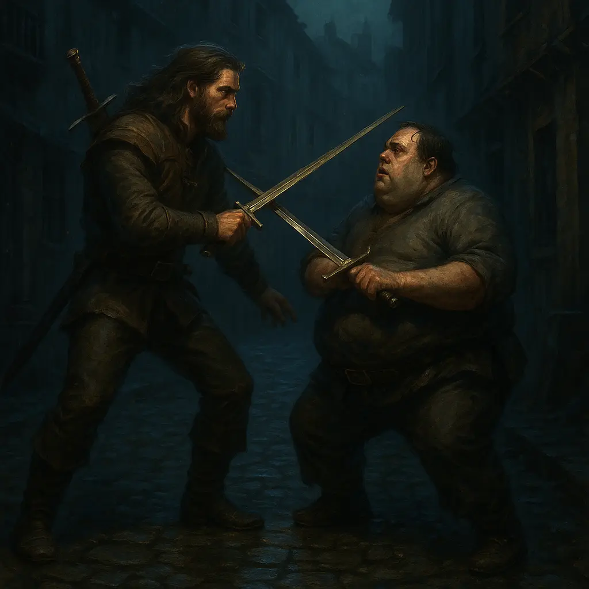
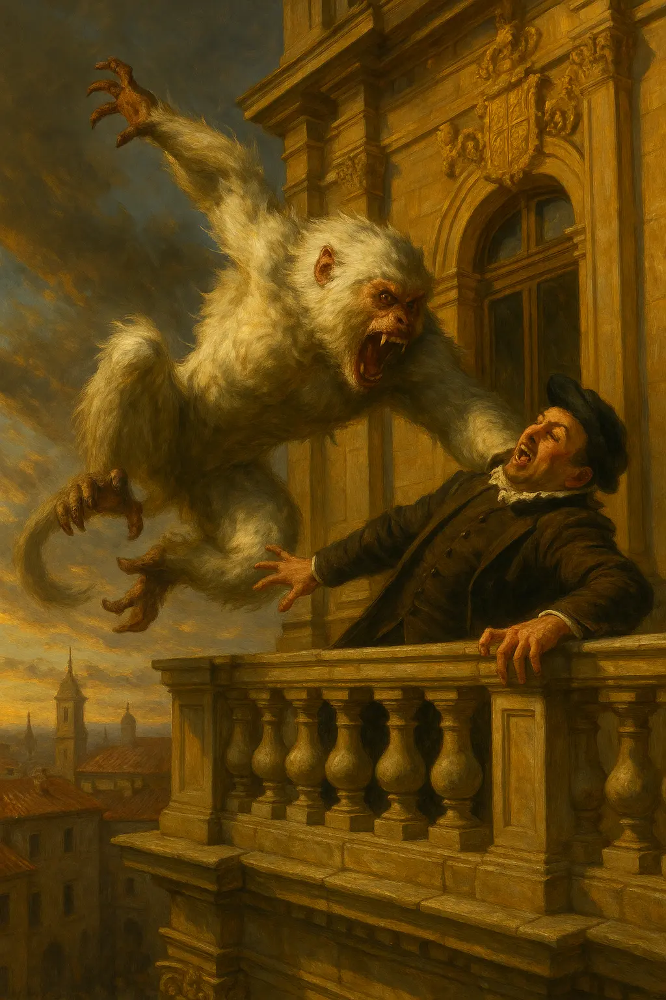
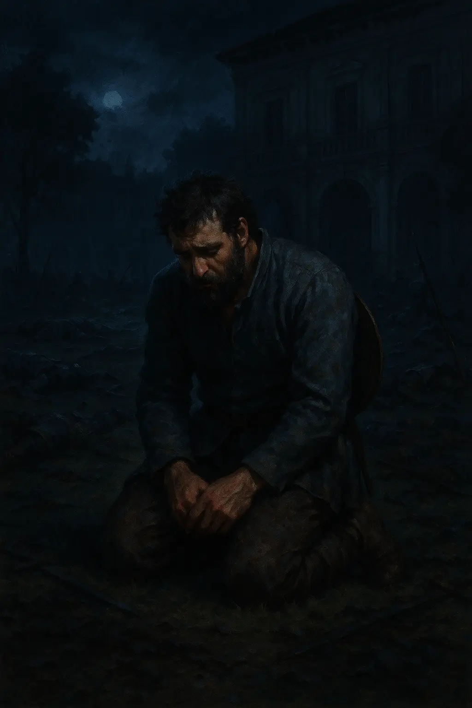
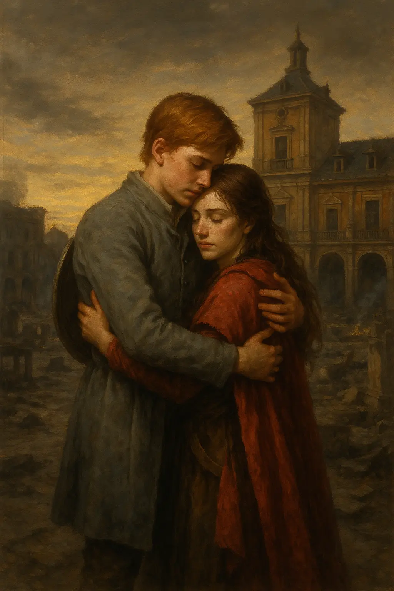
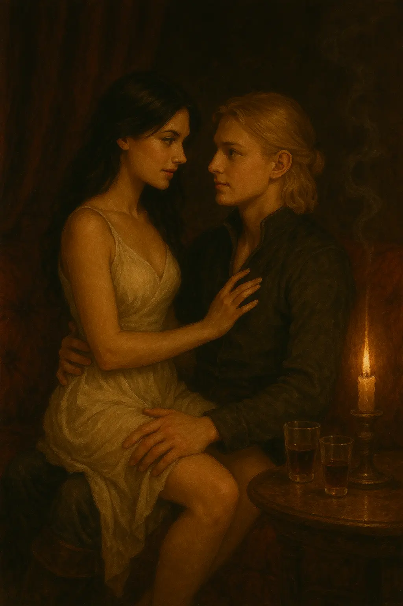

La nit s’havia tornat espessa com la sang vessada, i el silenci de la nau, abans ple de promeses, s’esquinçà amb l’entrada sobtada d’en Pepe Carvallo. Vaig recordar el seu rostre, tallat per l’experiència i la duresa, quan aparegué amb trenta homes uniformats de policia. Havíem ajudat en Kinnehan a eliminar en HH, i ara, en Pepe, amb la seva perspicàcia de caçador, ho havia descobert. La situació era clara: no podíem deixar-lo marxar, però la balança ens era desfavorable.

Alhora, per la porta del darrere, en Kamui, amb la seva armadura Dracheneisen brillant sota la llum tènue, es disposava a barrar el pas a un altre grup. Trenta homes més, però aquests no eren policies, sinó gent del barri baix, aliats d’en Kinnehan. Amb la seva entrada, la tensió a la nau s’equilibrà, com si els déus mateixos haguessin llançat els daus per donar-nos una nova oportunitat.

En un instant de distracció, en Pepe es girà i fugí per la porta principal, deixant els seus homes bloquejant-nos el pas. Sense pensar-ho dues vegades, vaig cridar amb tota la força dels meus pulmons:

—No deixeu que cap policia surti viu d’aquesta nau!

I, amb el cor bategant com un tambor de guerra, vaig córrer per la porta lateral, perseguint en Pepe sota la nit freda i traïdora.

La Helen, en Cedric i en Günnar s’enfrontaren als homes d’en Pepe a l’entrada principal. Els cops d’espasa ressonaven com un cor de ferro. En Günnar, però, aconseguí obrir-se pas i s’uní a mi en la persecució. La ciutat, amb els seus carrers estrets i carrerons tortuosos, esdevingué un laberint on en Pepe jugava amb avantatge. Coneixia cada pedra, cada ombra, i posava obstacles al nostre pas. La cursa era èpica, com si fóssim herois d’una antiga balada, però la distància no cedia.

Confiant en la força d’en Günnar, vaig decidir tornar a la nau: vèncer en Pepe no serviria de res si algun dels seus homes sobrevivia per explicar-ho. Vaig tornar, amb el cor pesant però decidit, per assegurar-me que la nostra missió no fracassés.

**

***Les aventures d’en Günnar***

*Mentrestant, en Günnar, amb la seva tenacitat nòrdica, retallà distàncies amb en Pepe. Quan finalment l’atrapà, en Pepe, exhaust i amb el rostre marcat per la fatiga, s’aturà i es girà, desenvainant l’espasa.*

*—Ja n’hi ha prou! —cridà, amb la veu trencada.*

*La lluita que seguí fou ferotge, un duel de titans sota la lluna. Les espases xocaven amb guspires, i la sang tenyí el terra. Tots dos, greument ferits, arribaren a un punt d’equilibri mortal. En Pepe, amb un gest inesperat, oferí una treva, i en Günnar, amb la saviesa d’un guerrer que sap quan l’orgull pot costar massa, acceptà. Una doble mort no hauria servit a ningú.*

**

Quan en Günnar tornà a la nau, ens reunírem, exhausts però vius. Cap policia, excepte en Pepe, havia escapat. Tot i això, el nostre pla s’havia torçat: era qüestió d’hores que en Pepe informés l’alcalde. La Helen i en Günnar, amb els ulls encesos per la determinació, proposaren un pla agosarat: assaltar la casa de l’alcalde per aconseguir els plànols abans que fos massa tard. En Kinnehan, amb un somriure astut, s’hi uní, parlant d’un cop d’estat. Nosaltres entraríem primer, amb l’Alina, transformada en animal, vigilant desde dins. Si les coses es complicaven, en Kinnehan i els seus homes ens donarien suport.

La casa de l’alcalde era un fortí, amb guàrdies armats patrullant el perímetre. Tot i això, en Kamui forçà la porta exterior i ens endinsàrem al jardí. Llavors, l’alcalde aparegué al balcó, amb una mirada de menyspreu, flanquejat per setze homes armats amb trabucs que ens rodejaren. Al seu darrere, en Pepe, amb els ulls plens d’odi, ens observava.

—Pagareu aquesta traïció amb la vostra vida! —proclamà l’alcalde.

La Helen, amb la seva veu clara i autoritària, respongué:

—Senyor alcalde, és vós qui heu traït. Si no haguéssiu enviat aquells homes, si no haguéssiu envoltat la zona amb la policia, el pla hauria estat perfecte i la nostra seguretat no s’hauria vist compromesa.

L’alcalde, furiós, replicà:

—Esteu amb les rates del barri baix! No perdrem més temps. Us eliminaré ara mateix!

—Senyor alcalde —digué jo, amb un to que tallava com l’acer—, esteu a punt de prendre l’última de les vostres males decisions. Us aconsello que ens lliureu els plànols, i a canvi nosaltres escamparem la boira, posant fi a aquest assalt.

—Jo? Però què dius? —es burlà l’alcalde—. Per favor, sou homes morts! Assalt a on? Si no podeu ni tan sols passar d’aquest jardí!

—S’equivoca —replicà la Helen, amb un somriure desafiant—. Ja som a dins!!

En aquell instant, un crit tallà l’aire. L’Alina, transformada en mico, caigué de la teulada sobre el balcó, amb un ganivet lluent a la mà. Agafà l’alcalde pel coll i, amb un moviment ràpid, el llançà al buit. L’alcalde s’estavellà al jardí, amb l’Alina sobre seu, com una deessa venjativa. Els guàrdies, sorpresos, ens apuntaren amb els trabucs, però l’Antonella corregué cap a l’Alina i, juntes, agafaren l’alcalde com a ostatge.

—Baixeu les armes o el mato! —cridà l’Antonella, amb la veu plena de foc.

Els esdeveniments següents foren un torbellí. L’Alina i l’Antonella entraren a la casa amb l’alcalde, forçant-lo a obrir la caixa forta per obtenir els plànols. Quan l’Alina els tingué a les mans i comprovà que eren autèntics, l’alcalde, amb un intent de traïció final, tragué un trabuc amagat. Però l’Alina, ràpida com el llamp, li clavà l’espasa, deixant-lo estès a terra. Totes dues fugiren per la porta del darrere.

Mentrestant, al jardí, en Pepe, sense paciència i amb els ulls encesos per la sospita del pitjor, ordenà als seus homes que ens ataquessin amb un crit que ressonà com un tro. La batalla esclatà amb una fúria desfermada, un caos d’espases, crits i pólvora. Estàvem ferits, amb el cos pesant per l’esgotament, però lluitàrem com un sol ésser, units per l’esperit d’una germandat forjada en el foc de mil perills. En Günnar, imponent com un senyor nòrdic, liderà l’enfrontament contra en Pepe. Al seu costat, jo el recolzava amb el meu escut alçat, aturant cops i obrint camí perquè ell pogués avançar. En Pepe, malgrat les ferides del seu duel anterior, aguantà amb un orgull ferotge, els seus moviments àgils i la seva mirada desafiant fins al darrer instant.

En Kamui, amb la seva armadura Dracheneisen resplendent, la Helen, amb la seva capa vermella onejant com una flama, i en Cedric, amb la seva espasa àgil, enfrontaven la resta de policies al nostre voltant, mantenint a ratlla els seus trabucs i espases. Finalment, en Pepe, afeblit però mai vençut en esperit, caigué sota un cop precís d’en Günnar, i els seus homes, desmoralitzats, es rendiren, derrotats, sota el pes de la nostra determinació.

Poc després, els homes d’en Kinnehan entraren a la casa, acompanyats d’una dona amb una presència imponent: la Grace Kinnehan. Més poderosa que el mateix Thomas, la seva bellesa era tan captivadora com temible. Ens felicità per l’operació, ens agraí amb paraules que ressonaven amb autoritat i ens oferí primers auxilis.

—La ciutat us ho agrairà —digué, amb un somriure que amagava mil secrets—. Ara, descanseu.

Tot havia sortit bé, però el cos encara em tremolava. L’alegria d’haver triomfat, de veure els meus companys sans i estalvis, em desbordava el cor. Vaig creuar la mirada amb la Helen i, sense dubtar-ho, vaig avançar i la vaig envoltar amb una abraçada franca i càlida.

—Estic feliç que tot hagi sortit bé —vaig murmurar, amb la veu plena d’un alleujament profund.

Vam marxar cap al Paraíso de Eli, amb els plànols a les mans i el cor ple d’orgull. Quan arribàrem, el bar esclatà en una celebració vibrant: les notícies de la nostra gesta havien volat com la pólvora. La Eli, amb crit alegre, exigí que ens convidessin a tots a una ronda de begudes. Alguns companys, amb les marques de la batalla encara visibles en la roba i la pell, preferiren rentar-se abans de sumar-se a l’alegria. Poc a poc, tothom anà marxant cap a les habitacions, exhausts però satisfets. Jo, però, em quedí al bar amb la meva amiga Sofia. Li preguntí si havia pensat en l’oferta que li havia fet, i ella, amb una mirada serena, respongué que sí, però que creia que era millor quedar-se a Magerit amb la seva família. A més, afegí amb esperança, la caiguda de l’alcalde podria portar una vida més pròspera a la ciutat.

—Ho entenc perfectament, Sofia —vaig dir, amb un somriure sincer—. Espero que tot et vagi bé. I si mai visites Valdeluna, si us plau, vine’m a veure.

—Reiv, d’on ha sortit un noi tan increïble? —respongué ella, amb una rialla tímida.

S’apropà més a mi i, asseguda a la meva falda, em féu mil preguntes sobre la nostra gesta i els meus orígens. Mentre li explicava les meves aventures i les terres llunyanes del nord, els seus ulls s’anaren tancant, i caigué en un son profund, rendida pel cansament. Amb cura, com si fos una princesa d’una antiga balada, la vaig agafar en braços i la vaig dur al meu llit perquè descansés. La vaig deixar allà, sota la llum tènue de la posada, amb el cor ple d’una tendresa que contrastava amb el caos que havíem sembrat aquella nit.
