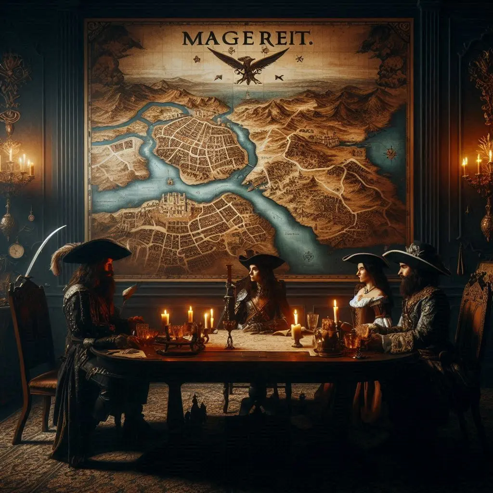
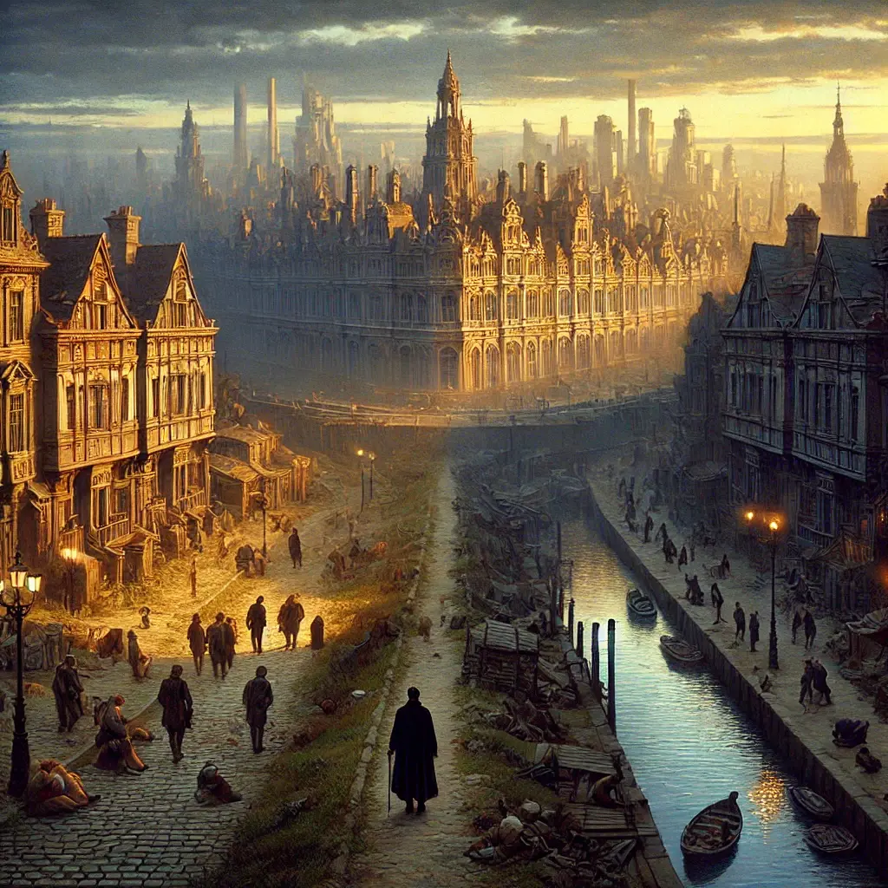
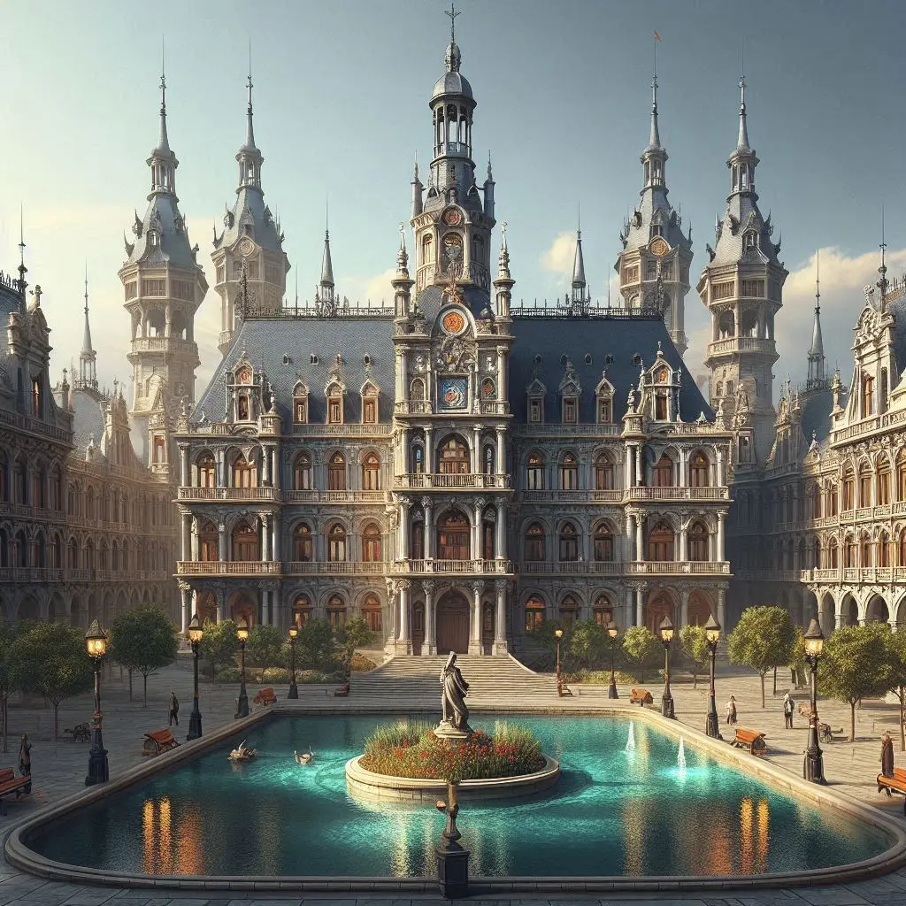

Aclarit el malentès, Alarik ens demana que l’acompanyem en una nova missió, aquesta vegada a una ciutat llunyana coneguda com a Magerit.

Arribàrem a Magerit després de tres llargues jornades a cavall. La ciutat es revelava imponent, molt més gran que Valdeluna. Situada en una vall i envoltada per tres rius, un d'ells navegable fins al mar, Magerit mostrava a simple vista les seves grans desigualtats. A la part alta, les mansions majestuoses i els carrers amples eren símbols de riquesa i poder, mentre que a la part baixa imperava la misèria: carrers bruts i estrets, on les ombres de les persones atrapades en addiccions recorrien les voreres amb rostres desfigurats pel desànim.

L'Alarik ens conduí cap al Paraíso de Eli, un prostíbul situat en aquesta part més desafavorida de la ciutat. L’establiment ens sorprengué pel seu aire refinat. L'interior era net i elegant, i les dones que hi treballaven no eren com ens havíem imaginat: tenien una presència culta i misteriosa, i transmetien una professionalitat inesperada en un lloc com aquell. Sembla que l'Alarik era un vell amic de la regent, l’Eli, qui ens oferí allotjament durant els pròxims dies.

L’endemà, l’alcalde de Magerit ens rebé a l’ajuntament, en una sala imponent i extremadament elegant. Ens explicà que havien trobat un vaixell enfonsat del qual havien rescatat uns plànols que l’Alarik estava buscant. Els oferí per un milió de gremials, una quantitat clarament desorbitada. Alarik refusà l’oferta i exigí un preu més raonable. L’alcalde, amb un somriure calculador, ens informà que existia una màfia avalonesa establerta a la ciutat que es dedicava al comerç d’opi i a la producció i venda il·legal de whisky. Si aconseguíem acabar amb aquesta organització i, preferiblement, capturar viu el seu líder, en Kinnehan, els plànols serien nostres. Afegí que, en dues setmanes, celebraria el seu aniversari i ens convidà a assistir-hi si assolíem l’objectiu.

Abans de marxar, ens recomanà que visitéssim la comissaria i preguntéssim per Pepe Carvallo, el cap de la policia, per obtenir més informació.

Dediquem la resta del dia a recórrer el barri pobre, intentant obtenir informació rellevant sobre l’organització de Kinnehan, però amb poc èxit. La dada més interessant sobre l’opi ens la proporcionà Fernando Secas, el propietari del Bar Secas. Ens explicà que hi havia un carrer anomenat Herreros, on es trobava una porta roja. Allà es venia opi.

Cansats i frustrats, decidírem anar a dormir aviat.
