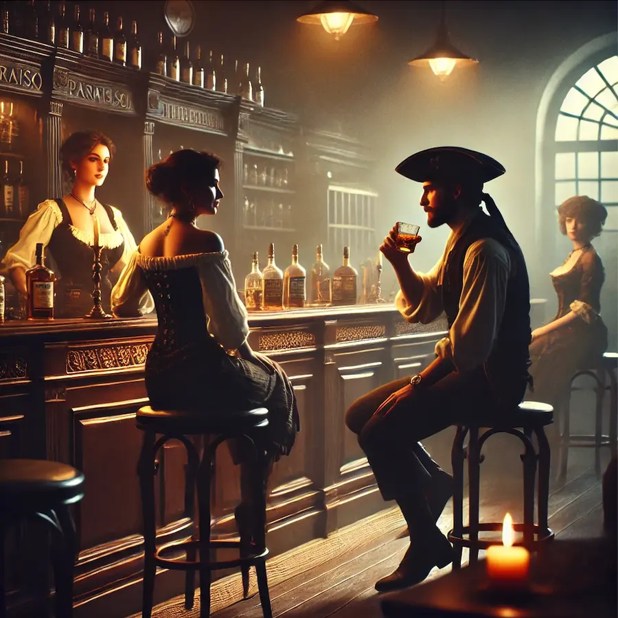
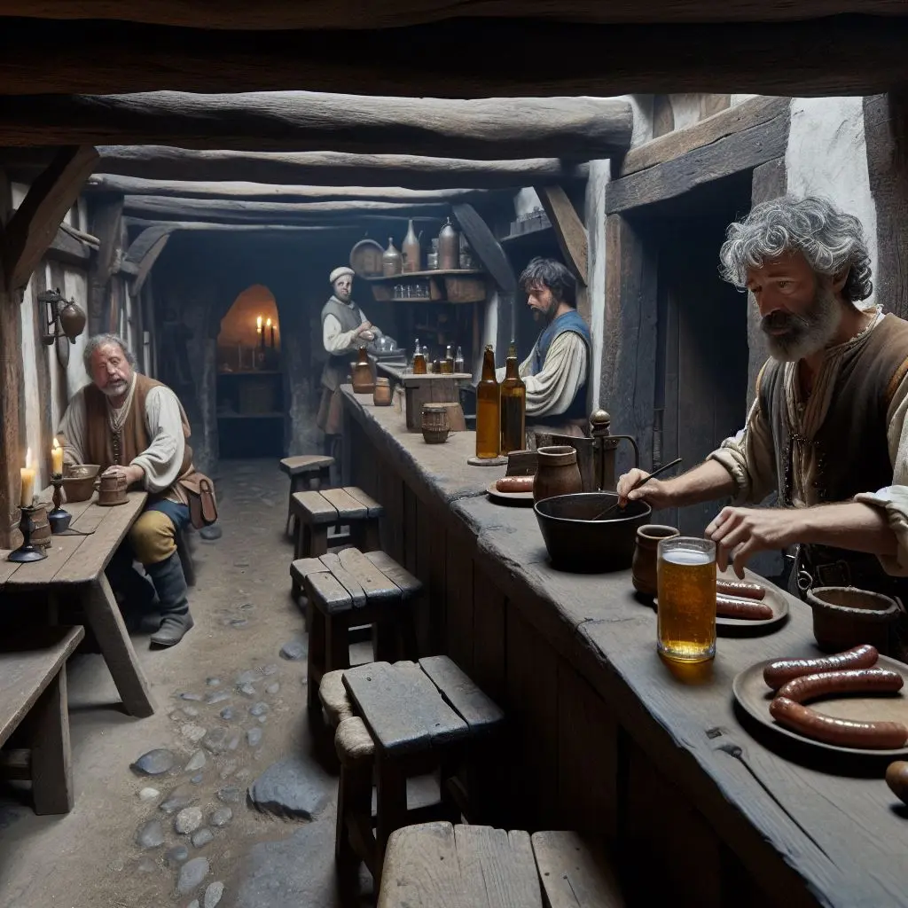
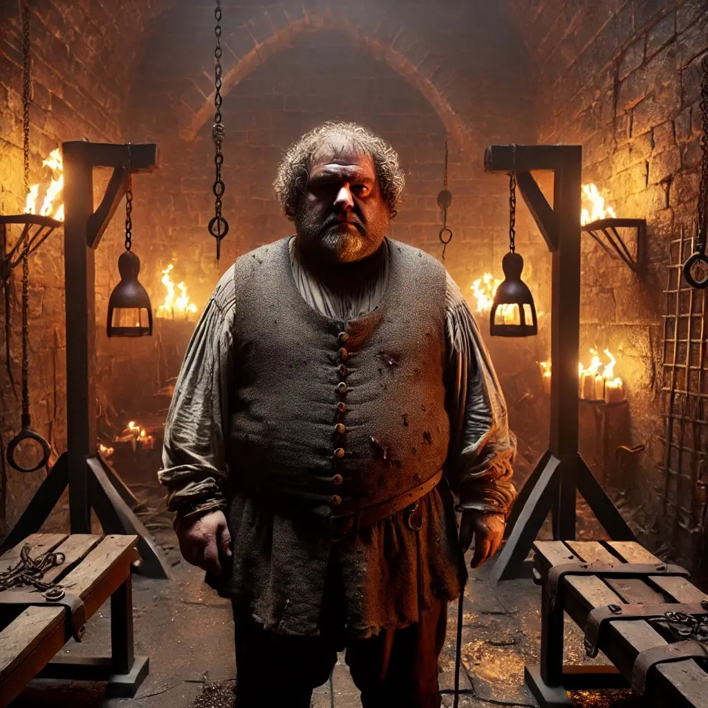
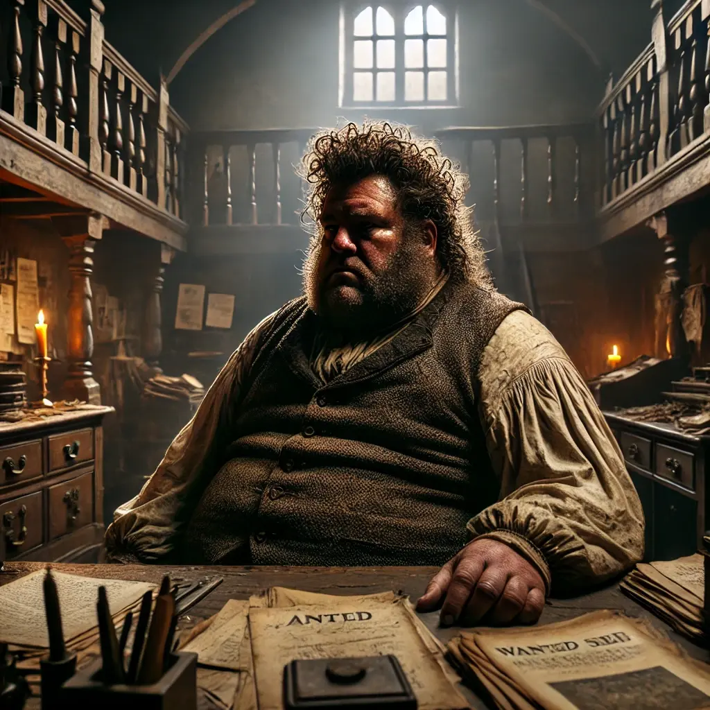
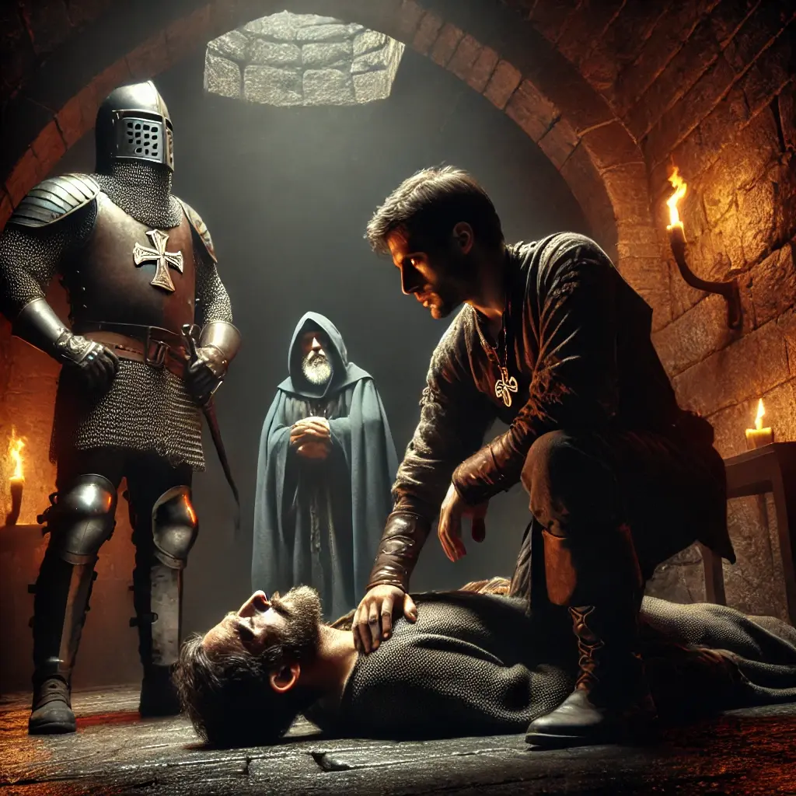
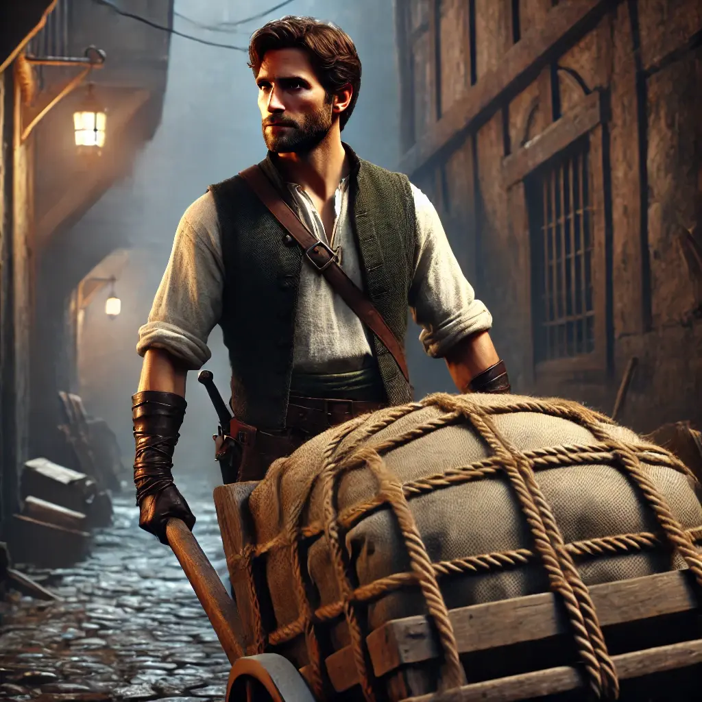
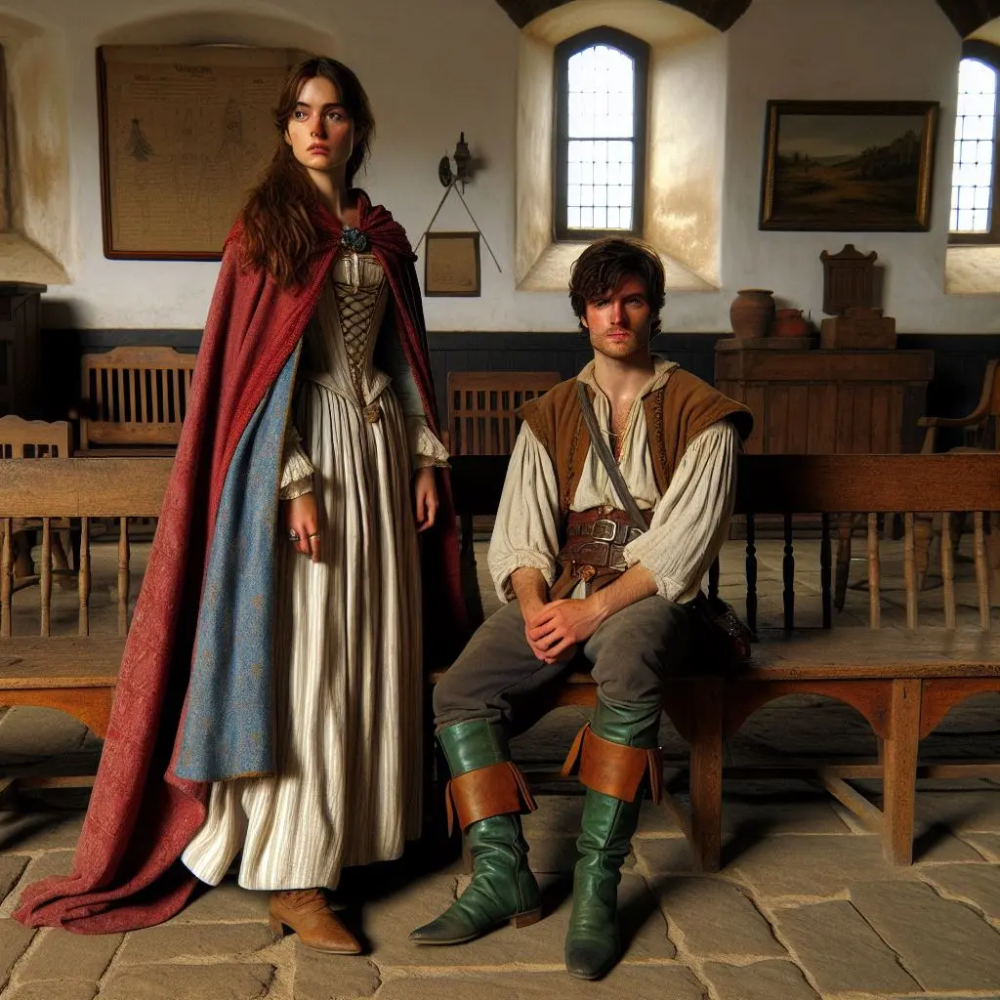

L'endemà, baixí a esmorzar a la barra del Paraíso de Eli. Però no hi havia res per menjar, només begudes. M'atengué Sofia, una senyoreta de bellesa captivadora, i demaní un licor d'herbes. Aprofití l’ocasió per preguntar-li sobre els homes de Kinnehan. Amb una actitud despreocupada, comentà que ajudaven molt al barri. Mentre conversàvem, arribà l'Alina i s'assegué al meu costat. Demanà un got de whisky, interrompent la conversa per xafardejar sobre l'origen del licor. Com que no aconseguírem gaire informació, decidírem anar a la taverna de José per esmorzar.

A la taverna, demanàrem salsitxa amb ous, pa i hidromel per beure. En preguntar sobre Kinnehan i el whisky, el taverner es mostrà visiblement evasiu i incòmode, responent amb poques paraules. Després d’unes quantes preguntes més, remugà:

—Si feu tantes preguntes, me’n vaig a la cuina.

I s'esmunyí cap al darrere. L'Alina, observadora com sempre, mirà sota la barra i li semblà veure unes ampolles semblants a les del whisky del Paraíso de Eli.

L'Alina ens avisà que es transformaria en gat per espiar l'alcalde i li férem un gest perquè ens retrobéssim al Paraíso a les sis de la tarda. Mentrestant, en Gunnar, la Helen i jo decidírem anar a la comissaria.

**

***Les aventures d’Alina***

*Transformada en gat, l’Alina s'esmunyí silenciosament per una finestra de l’ajuntament. Amb moviments sigilosos, s’amagà darrere d’un moble mentre observava l’alcalde de la ciutat parlant amb un home robust, que semblava estar negociant amb Rom. L’atmosfera era tensa, plena de mitges paraules i mirades còmplices.*

*—Els problemes amb en Kinnehan s’han agreujat —digué l’home, amb una veu greu i pausada.*

*—Ho sabem. Però us asseguro que ben aviat ens en desfarem —contestà l’alcalde, amb un to segur.*

*L’Alina parpellejà, atenta a cada detall. Tot i l’ambigüitat de la conversa, una cosa quedava clara: l’alcalde no només coneixia els moviments de Kinnehan, sinó que estava implicat en alguna mena de joc de poder.*

**

Les portes del calabós es tancaren darrere nostre amb un cruixit metàl·lic. Pepe ens mirà amb un somriure groller mentre interrogava un presoner a cops de puny. En veure’ns, li clavà un darrer cop de puny al ventre, deixant-lo caure a terra com un sac de patates. El presoner agonitzava, la seva respiració era un xiuxiueig trencat. Ens sorprengué que encara fos viu.

—Lamentablement, les rates no parlen —digué Pepe, mentre s'eixugava la sang del puny amb una tela bruta.

Aquell home era fastigós. Obès i brut, amb els cabells greixosos enganxats al cap com retalls mal posats, tenia un aire d'arrogància insuportable. Però, malgrat la seva aparença, era sorprenentment obert amb nosaltres. Gaudia del joc. Preguntàrem, amb un cert to de repulsió, pel presoner que acabava de torturar. Pepe repetí que era una de les rates de Kinnehan i insistí, amb el seu somriure sinistre, que les rates no parlaven.

Atabalàrem en Pepe amb preguntes sobre el cos policial. Ens explicà que comptaven amb uns seixanta efectius, però només deu d’ells eren de la seva màxima confiança. Ens parlà d’infiltrats a la policia i afirmà que Kinnehan tenia homes per tot arreu. L’Hugo, la seva mà dreta, era un noi jove, discret i formal, la seva afinitat amb Pepe sorprenia, atesa la seva naturalesa elegant. A més de la policia, l’alcalde disposava d’una guàrdia personal d’uns deu homes.

Pel que fa a l’organització que perseguíem, feia tres anys que controlaven la xarxa de tràfic a Magerit. Malgrat els esforços de la policia, encara no havien aconseguit atrapar-los. Sempre arribaven tard: trobaven els magatzems buits o els locals abandonats. Feia sis mesos havien estat a punt d’aconseguir-ho, després de rebre una pista que els permeté assaltar un local abans que fos desmantellat. Tot i que els criminals van escapar, la policia pogué confiscar una gran quantitat de material.

Mentre reflexionava sobre les nostres possibilitats i la urgència de treure informació, em vingué al cap un pla. Amb un somriure astut, proposí a en Pepe que ens deixés treure el presoner fent-lo passar per mort; si ens guanyàvem la seva confiança, potser aconseguiríem fer-lo parlar. Pepe, rient amb la seva veu aspre, acceptà. Digué que el desgraciat probablement ja era a les últimes, però ens donà via lliure: tant si parlava com si no, la nostra tasca seria tirar-lo al riu quan acabéssim.

Dos guàrdies ens escortaren fins a la sala. En Gunnar s'agenollà davant del presoner, li examinà els ulls mig tancats i, amb veu ferma, declarà davant els guàrdies que era mort. Ho feu tan bé que fins i tot jo gairebé cregué que el presoner havia exhalat el seu últim alè.

Embolicàrem el cos amb una tela i el traguérem fora, on en Cedric i en Kamui ja ens esperaven amb una carreta.

Mentre ens dirigíem al Paraíso de Eli, una tensió estranya pesava en l'ambient. Aquest presoner podria tenir les respostes que buscàvem, però les seves ferides eren tan greus que dubtàvem que sobrevisqués fins a l'alba. En arribar, en Kamui demanà a l'Eli si tenia un lloc discret on portar-lo. Ella sospirà, visiblement farta de les nostres complicacions, però ens oferí un pis franc, amb la condició que no li causéssim més problemes.

Un cop al pis, en Gunnar es posà mans a l’obra. Malgrat la seva destresa, el presoner es trobava en un estat tan precari que la Helen i jo sabíem que no seria suficient. Ens creuàrem mirades i, amb un lleu moviment de cap, arribàrem a un acord: farem servir la màgia Glamour conjuntament per millorar les capacitats d’en Gunnar.

Ajudàrem l’home a recuperar-se, però sabíem que el preu a pagar era alt: un dolor insuportable travessà els cossos de la Helen i en Gunnar. Ella s’encongí, mentre ell sentí com si el seu interior es trenqués. Havíem aconseguit salvar-lo, però ara érem nosaltres qui estàvem en perill.

L’Eli, angoixada i molesta, ens informà que hi havia un hospital al barri, però que era millor que anéssim al barri noble. Hi anaren tots excepte en Kamui i jo. Per si feia falta, li deixí 800 monedes a en Gunnar.

A l’hospital noble, els oferiren un tractament per 1500 monedes, però els molt garrepes decidiren retornar al barri pobre. Allí, un metge amb un aire esgotat i potser massa aficionat a la beguda els atengué.

—Benvinguts al centre Providència, el millor centre sanitari de la ciutat! —exclamà amb una rialla carregada d’alcohol.

Malgrat l’escassa confiança que inspirava, en Gunnar accedí a l’operació. En Cedric i la Helen esperaren durant hores fins que el metge aparegué per assegurar-los que tot havia anat bé, tot i que en Gunnar hauria de quedar-se ingressat tota la nit. En Cedric es quedà a fer-li companyia, mentre que la Helen tornà al pis.

Mentrestant, al pis franc, el presoner es despertà breument. La seva veu era un fil, però aconseguí dir-nos el seu nom: Niels. Abans de tornar a caure inconscient, ens revelà que en Pepe l’havia capturat mentre traficava amb opi.
