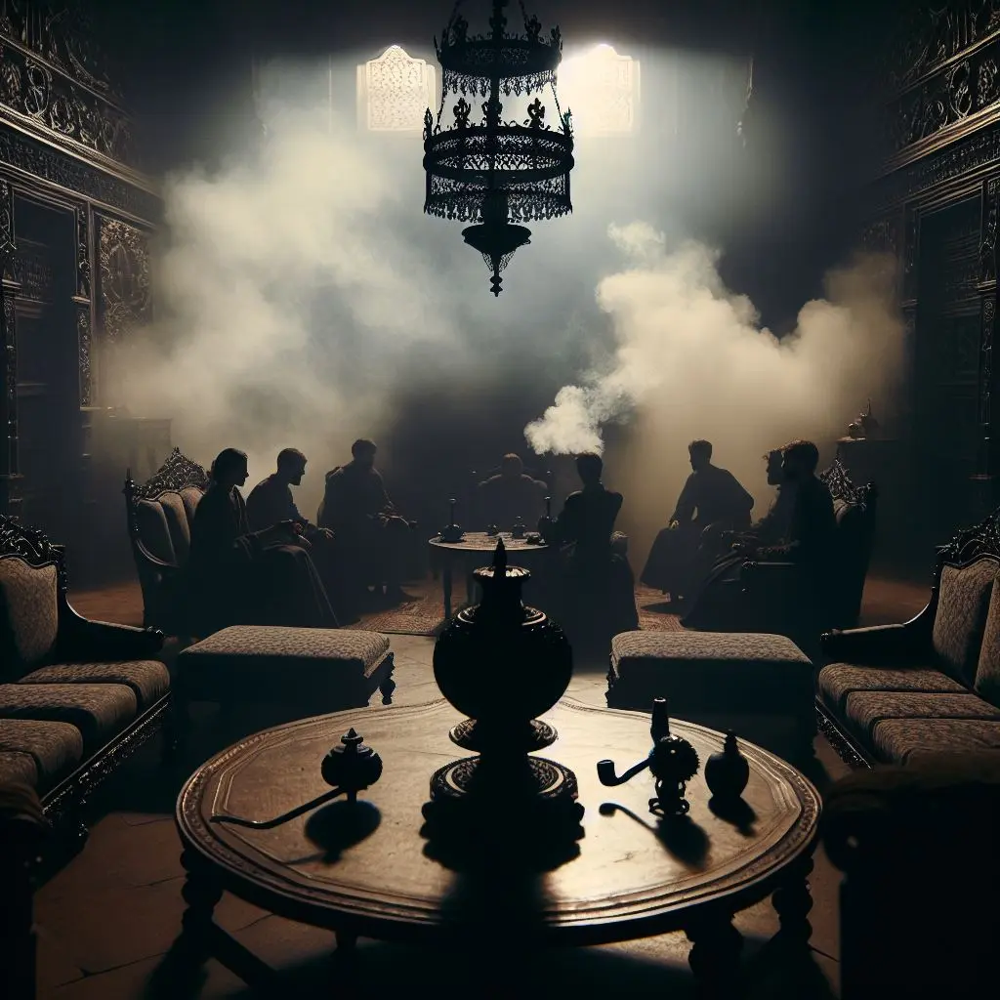
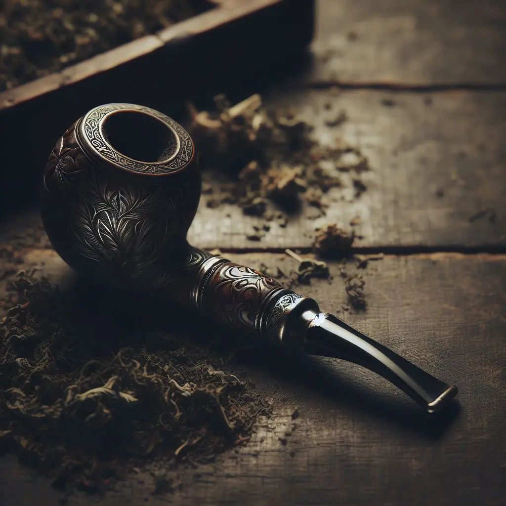
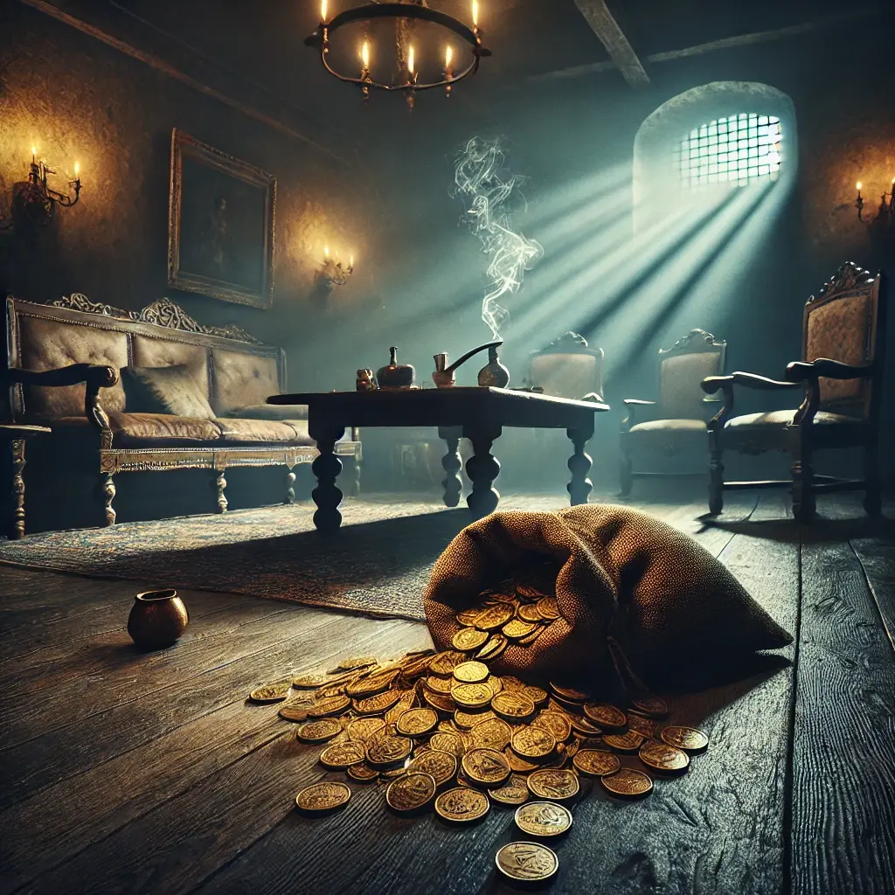
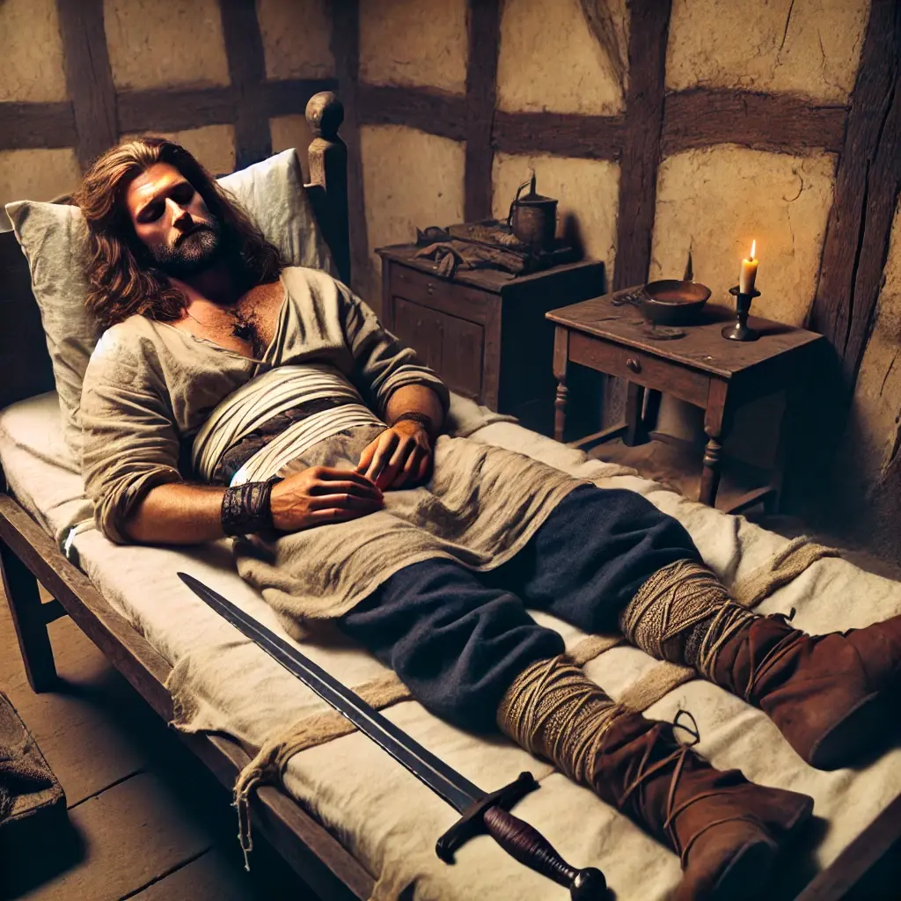
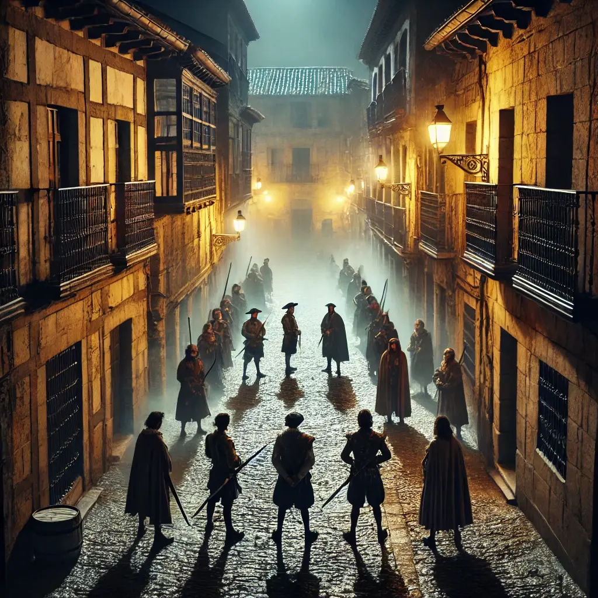

La jornada arribava al seu final quan la Helen em proposà un passeig pel carrer Herreros. De passada, volia comprar una mica d'opi. Arribàrem a la porta roja que ens havia indicat en Fernando Secas. A prop de l'entrada, hi havia dos grups: un de dues persones i un altre de quatre, amb una presència inquietant. Sense pensar-s'ho dues vegades, la Helen preguntà directament on podíem comprar opi. Entre rialles malicioses, els malfactors ens indicaren que entréssim per la porta i pugéssim fins a la tercera planta.

Un cop a dalt, ens trobàrem en una habitació ombrívola, impregnada d'una espessa boirina de fum. Vuit persones seien en coixins descolorits, inhalant opi en silenci. Al centre de la sala, amb un posat de rei sense corona, hi havia l'Olav, el líder de la casa.

—Què hi feu aquí? —preguntà.

—Hem vingut a comprar opi —respongué la Helen amb naturalitat.

—Heu arribat al lloc correcte. Ara, doneu-nos tot el que porteu... i seieu.

Dos matons de l’Olav s’acostaren a mi, disposats a arrabassar-me el poc que em quedava. Els vaig fer front, ferm però pacífic, i vaig resistir el primer intent de prendre’m la bossa. Però al segon intent, van atacar. Vaig esquivar i colpejar un d’ells, fent-lo caure a terra. La tensió s'intensificà de sobte.

Enmig del caos, un altre home aprofità l’ocasió per arrabassar-me la bossa de monedes i la lliurà a l’Olav. Amb un somriure burleta, ens llançà una pipa d’opi consumida.

—Endavant, fumeu!

—Venim a comprar opi per passar una bona estona, i així és com ens tractes? —li vaig dir, fixant-li la mirada amb fredor. Ens robes i ens dones merda? Ens estàs prenent el pèl? Torna’m la bossa ara mateix.

Vaig llençar la pipa a terra amb desdeny.

Un altre home s'acostà cap a mi, aquesta vegada amb un ganivet en mà, amenaçant-me. Al mateix temps, quatre homes es dirigiren cap a la Helen, intentant immobilitzar-la. Però ella, contundent i ràpida com sempre, tombà dos dels atacants amb moviments precisos. Així i tot, acabaren retenint-la.

La tensió es descontrolava. Els meus músculs es tensaren, preparat per una altra ofensiva, quan de sobte, la veu de la Helen trencà el caos:

—Tenim a en Niels.

La sala quedà completament en silenci, només interromput per la respiració pesada dels presents.

—Com? —preguntà l'Olav, incrèdul, amb els ulls clavats en ella—. Què coi vols dir amb això?

La Helen, ara nerviosa, intentà explicar-se, però Olav ja no atenia raons.

—Porteu-me a en Niels ara mateix! —cridà, furiós.

L'Olav m'ordenà que marxés, deixant la Helen sola com a ostatge. Intentí explicar que en Niels s'estava recuperant i que encara no es podia moure, però la situació no feia més que empitjorar.

—Us presenteu dos estranys a casa meva, causant-me problemes, i a sobre em dieu que teniu en Niels capturat i espereu que us deixi marxar?

—No el tenim capturat, sinó que l'hem rescatat de la comissaria.

—La comissaria? Això és cada cop més estrany.

L'Olav ordenà a dos dels seus homes que anessin a casa d'en Niels a comprovar la situació. Una calma tensa s'establí a la sala; semblava que podríem aclarir el malentès. Ens convidà a beure cervesa i fumar, amb l'actitud de qui t'està perdonant la vida. Intentàrem proporcionar-li una explicació creïble sobre qui érem i què fèiem a Magerit, però els nervis ens impedien articular un missatge coherent.

Quan tornaren els seus homes, li murmuren alguna cosa a l'orella. L'Olav em llançà la bossa de monedes oberta, de manera que algunes caigueren a terra, i m'ordenà novament que me'n anés a buscar en Niels. Recollint la bossa, empenyí les monedes que havien caigut amb el peu.

—Això t'ho pots quedar —li diguí a l'Olav—. I no penso deixar la Helen sola. És evident que hem començat amb mal peu, però vull que sàpigues que tenim interessos en comú. Seria bo rebaixar la tensió i escoltar-nos d'una vegada.

—No us escoltaré fins que no porteu en Niels. Ja!

Tot el que dèiem no feia més que escalfar l'ambient. Finalment, ens veiérem obligats a enfrontar-nos directament amb l'Olav i en Bruto, el porter de la casa. L'enfrontament acabà deixant-nos malferits, i acceptàrem que la Helen anés a buscar en Niels. Cinc homes de l'Olav, incloent en Bruto, l'acompanyaren.

La Helen s'apropà al pis franc. Demanà als escoltes que la deixessin pujar sola. Un cop a dalt, li explicà a en Kamui tot el que havia passat, amb la veu baixa i intensa, i li demanà que acompanyés en Niels, recordant-li que l'objectiu principal era alliberar-me a mi. Sense perdre temps, la Helen corregué cap a l'hospital, decidida a reclamar l'ajuda d'en Gunnar i en Cedric.

Per sort, en Gunnar es despertà, recuperat del seu estat precari. Tots tres es posaren en marxa cap al carrer Herreros, com si el temps fos el seu enemic. No obstant això, enmig del camí, un tret ressonà a l'aire. Seguit d'un altre.

En Kamui havia disparat a un dels homes que acompanyaven en Bruto, deixant-lo estès a terra. El caos esclatà; en Kamui no es detingué. Amb un altre tret, ferí en Bruto. Un preludi de violència que sacsejà l'ambient. La batalla es desencadenà, i dos homes més de l'Olav caigueren com fardells al terra polsegós.

En Bruto i l'últim home fugiren cap al carrer Herreros, buscant reforços desesperadament.

Finalment, tots ens reunírem: la Helen, en Gunnar, en Cedric, i en Kamui, davant de l'Olav i en Bruto, amb més de vint dels seus homes. L'Olav, amb una mirada que cremava, ordenà que deixéssim en Niels a terra. Ell, despertant durant uns breus segons, confessà amb un fil de veu: estava a la comissaria, atrapat pel Pepe, i el següent que recordava era despertar en un pis davant d'en Kamui, amb totes les ferides sanades.

L'Olav, que ja no podia contenir la seva impaciència, ordenà als seus homes que em baixessin. Però abans de deixar-me anar, el punxó del seu ganivet m'impactà per l'esquena i un dolor agut em travessà com un llampec.

—Demà marxareu de la ciutat quan trenqui l'alba. Si us torno a veure, us mataré —va dir, sense deixar espai a la interpretació.

L'ombra de la mort es va fer present, i la nostra ment es va omplir de la convicció que, en aquella ciutat turbulenta, la nostra lluita estava lluny d'acabar.
