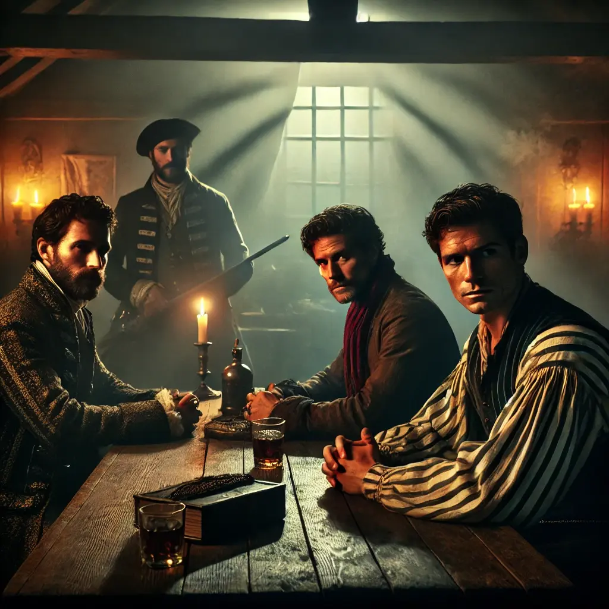
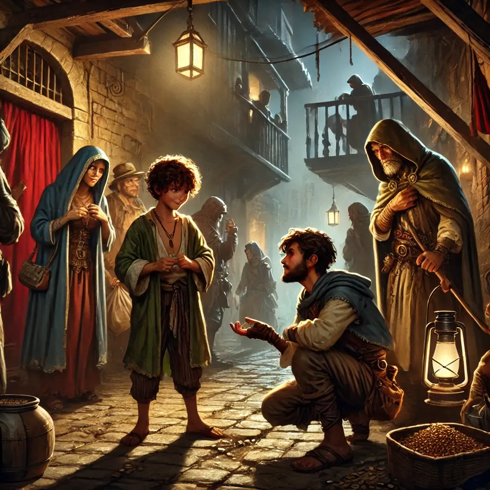

Ens llevàrem a primera hora del matí, amb la ferida encara ardent i la ment carregada de dubtes i pors. El sol començava a despuntar mentre ens dirigíem de nou cap al carrer Herreros. En Bruto, ara amb una actitud més pacífica, ens esperava davant del bar Sagartoki i, amb un gest sec, assenyalà l’entrada. Sense intercanviar paraules, travessàrem la porta i ens deixàrem engolir per la penombra del local.

A l’interior, l’Olav ens guià cap a una sala privada. L’ambient era espès, carregat de fum i tensió. A l’estança ens esperaven tres homes. Un d’ells vestia amb una elegància impecable, el cabell endreçat i un gest estudiadament neutre; el segon tenia un estil més pintoresc, amb una samarreta de ratlles i un mocador vermell al coll, donant-li un aire desenfadat. El tercer, en canvi, imposava per la seva presència seriosa i calculadora: Thomas Kinnehan. Els seus ulls freds ens analitzaren amb deteniment.

—No hauríeu d’haver marxat de la ciutat ja? —preguntà Thomas, amb una veu plana i mancada d’emoció.

Mantinguérem una conversa tensa, però aquesta vegada amb el cap més fred. Explicàrem que els esdeveniments de la nit anterior havien generat un conflicte inesperat, però insistírem que compartíem més interessos dels que ens separaven. Assenyalàrem que el tracte brusc i arrogant de l’Olav havia precipitat els malentesos, una afirmació que Kinnehan semblà acceptar. Amb un sospir mesurat, ens demanà disculpes per les formes del seu home.

—En Niels ha confirmat la vostra versió. Això us salva, de moment. Però encara sou una molèstia. No sé res de vosaltres, ni dels vostres plans, i això em fa recelar. —La seva veu era calmada, però no hi havia rastre de confiança en ella.

Insistírem que no podíem abandonar la ciutat, que la nostra feina allí no havia acabat. Li proposàrem treballar plegats, aprofitant la nostra posició i contactes, però Thomas es mantingué impassible.

—Si no em porteu un tracte que m’interessi, no us puc permetre quedar-vos —conclogué, amb una serenor inquietant.

Ens donà fins a l’endemà a les vuit del vespre per trobar una proposta prou convincent. Si no, ens faria fora de Magerit.

Sortírem de la reunió amb una barreja de frustració i determinació. Al nostre grup, les opinions divergien. Alguns volien observar els negocis d’opi i whisky des de l’ombra, o investigar la vida privada de l’alcalde amb discreció. D’altres, en canvi, tenien intencions més radicals: extorsionar l’alcalde o fins i tot organitzar un atemptat per robar els plànols de l’ajuntament.

Durant el dia, ens dispersàrem a la recerca d’informació. Els nobles del grup ens dirigírem al barri alt per dinar al restaurant Tres Reyes. Per precaució, ens asseguérem separats en dues taules diferents: la Helen i jo en una, en Kamui i l’Antonella en l’altra. Abans de dinar, prenguérem un rom a la barra i entaulàrem conversa amb un home anomenat Alonso, un comerciant de rom amb un somriure murri i gesticulació exagerada. Ens recomanà visitar el bar Paraíso per degustar un bon rom, així com el club Esqueleto per ballar i l’hipòdrom com a punt d’interès per a aquells que volguessin conèixer els moviments de l’elit de la ciutat.

Mentrestant, en Kamui conversava amb dos homes, Benjamin i Gregorio Pino, que discutien sobre terres i inversions. La conversa es tornà especialment interessant quan esmentaren que tenien una cita amb l’alcalde, una oportunitat d’or per descobrir més sobre els afers polítics de Magerit.

Quan caigué la tarda, ens dirigírem al bar Paraíso. L’establiment obria a les vuit en punt, i ens rebé en Frederik, el propietari. Era un home que semblava saber molt més del que deia. A poc a poc, ens confirmà que l’alcalde estava immers en una lluita ferotge contra la màfia del whisky. També mostrà un odi irracional envers el barri baix. La seva fidelitat a l’alcalde era evident. Ens suggerí visitar El Dorado, un local d’apostes. L’Antonella, sempre atenta als signes del destí, observà la hebra de Frederik. El seu vincle es revelà en una carta de rei d’espases: un sentiment fort que el lligava a una persona gran.

Amb tota aquesta informació, tornàrem a reunir-nos per decidir el nostre proper moviment. L’endemà seria un dia clau. Si no trobàvem una proposta convincent, la nostra estada a la ciutat podria acabar abans del que voldríem.

Mentrestant, els plebeus Kelsier, Alina, Cedric i Eryn voltaven pel barri pobre, disfressats de rodamons, per buscar informació sobre l’opi. Conegueren el Pepito, a qui enredaren per canviar-se les samarretes: l’Alina li digué que eren unes samarretes màgiques que feien créixer un dit. Quan se la posaren el Pepito i els seus amics, confirmaren que tenien sis dits, i al·lucinaren. Kelsier i Alina compraren una mica d’opi al venedor del Pepito, en Manu. L’Alina li digué que aquella merda era molt dolenta, i descobrí que hi havia dues qualitats. El Manu entrà a la casa de la porta vermella i, uns minuts més tard, li tragué un opi molt més bo i car. L’Alina se’l guardà.
