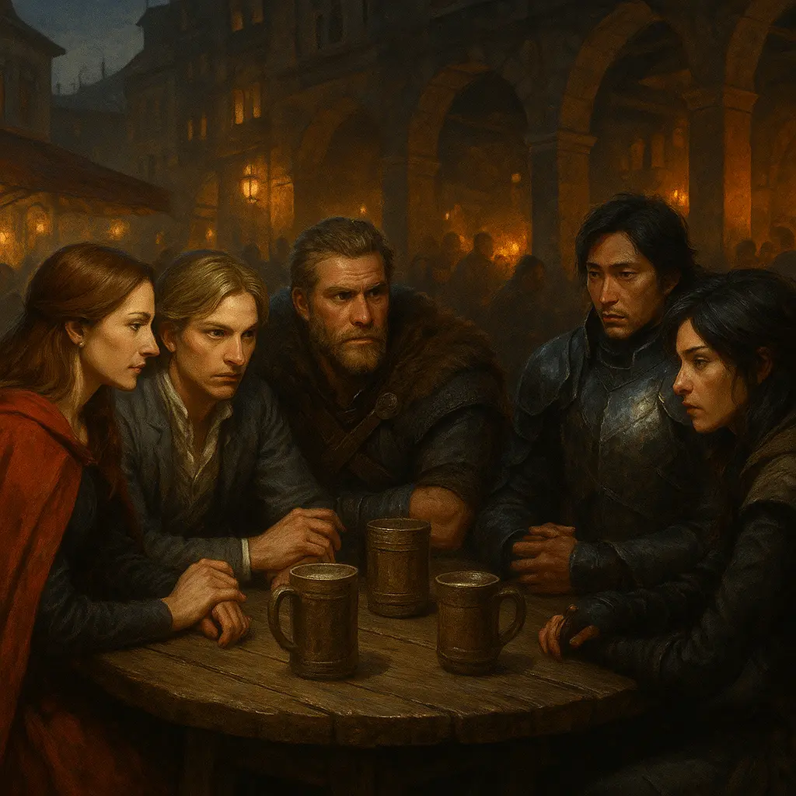
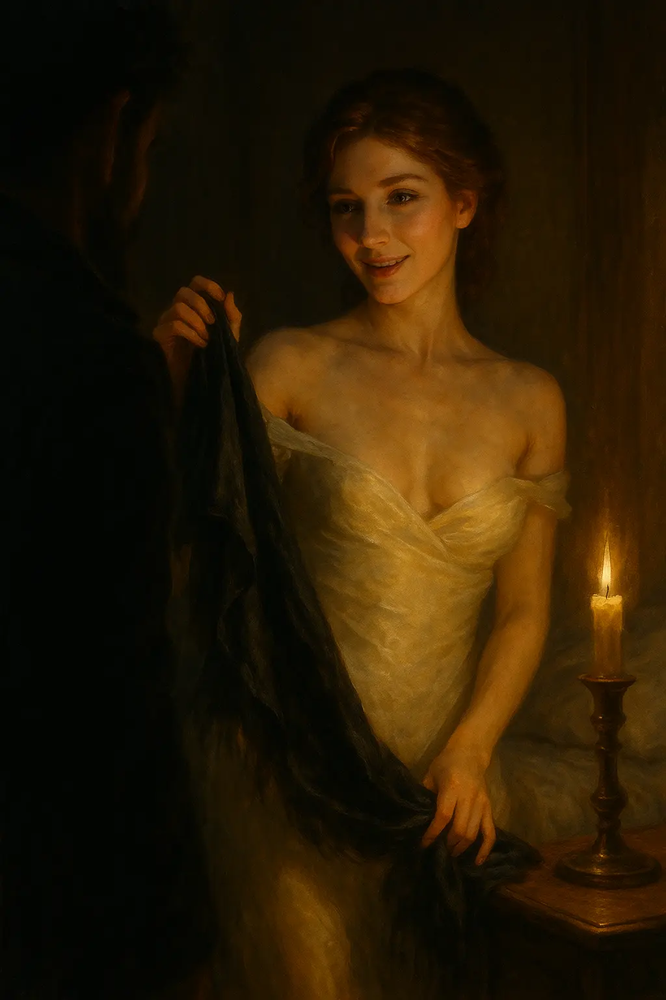
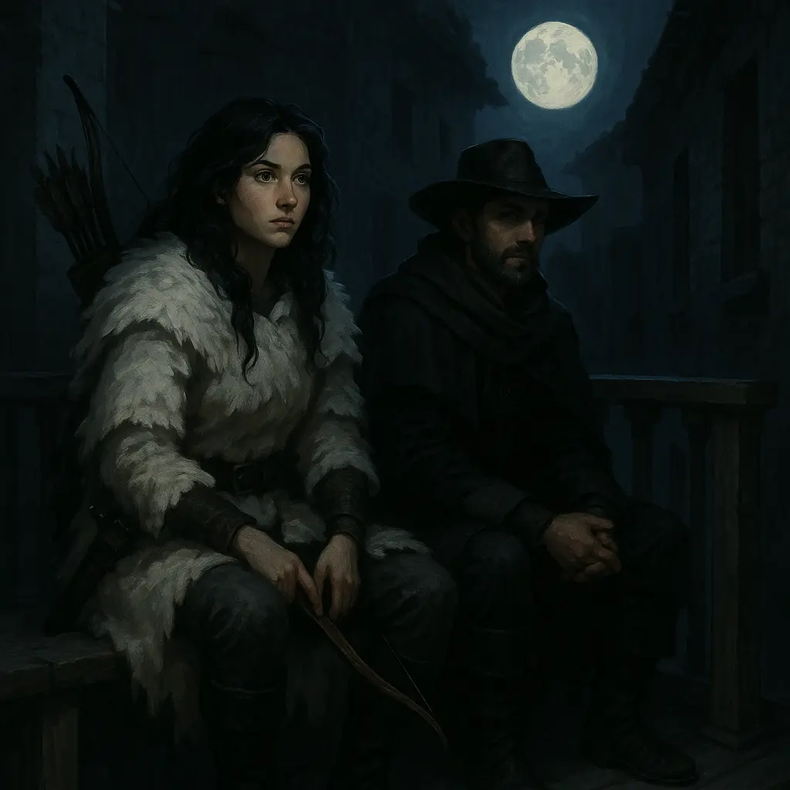
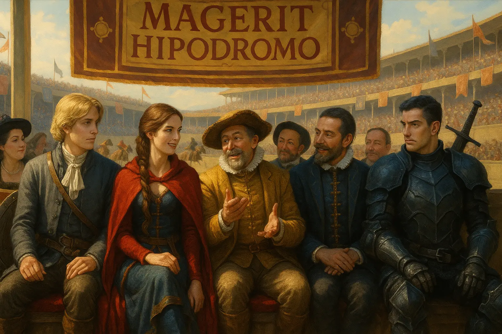
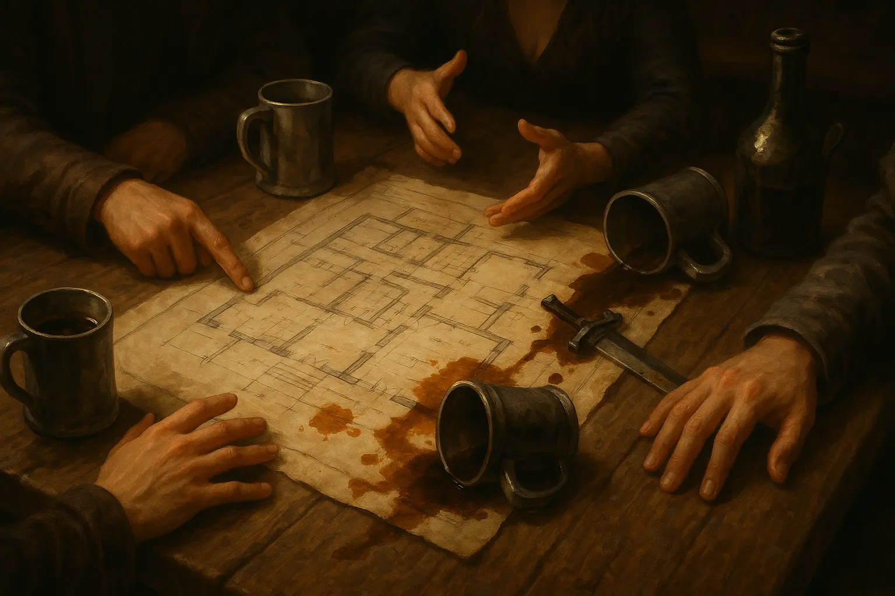
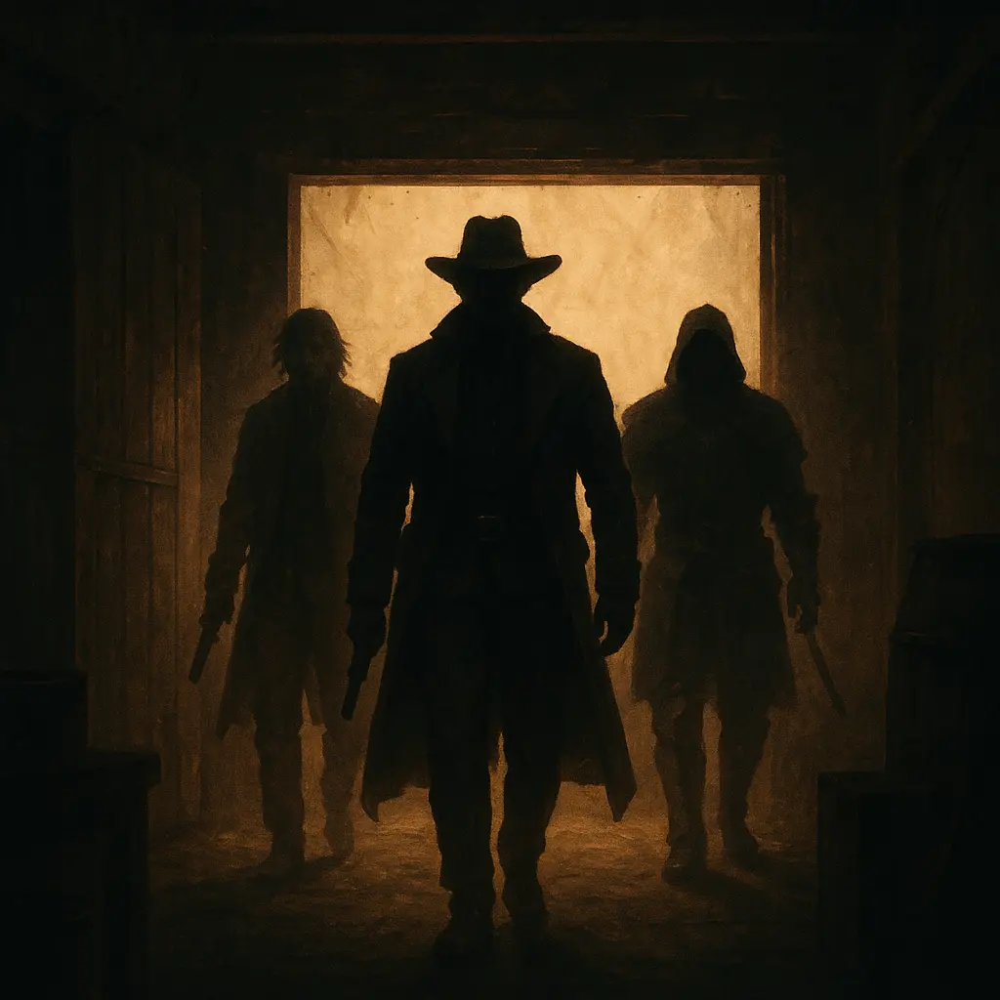
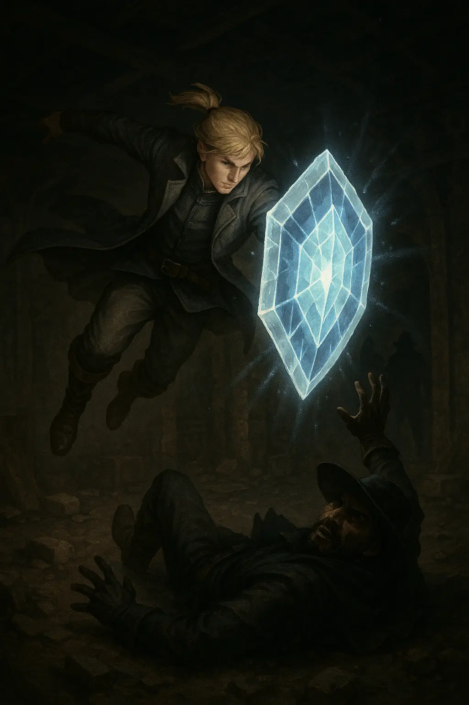

El sol s'havia post rere els murs de Magerit, deixant la ciutat submergida en un mantell de penombra que semblava xiuxiuejar secrets a cada carreró. Sentíem l'aire espès, carregat de sospites, mentre ens allunyàrem de l'ajuntament amb la sensació inquietant que érem preses d'una cacera. L'Alina, amb el seu instint felí i els ulls escrutant les ombres amb una intensitat que em posà la pell de gallina, murmurà que algú ens seguia. No vérem ningú, però la seva mirada mai no mentia. Ens aturàrem en un bar de la plaça del mercat, un indret ple de vida i xivarri, on les rialles i el dring de les copes podien amagar les nostres paraules.

Amb veus baixes i mirades discretes, traçàrem un pla per despistar qualsevol ombra que ens seguís. Acordàrem dividir-nos en petits grups i retrobar-nos a la posada quan la nit hagués caigut. Així podríem passejar i atreure qualsevol perseguidor. L'Alina, amb un somriure maliciós, prometé seguir-nos des de les teulades, transformada en gat, per desemmascarar qui ens tenia l'ull posat. La Helen s'oferí a reservar habitacions en una posada propera, ben lluny dels nostres refugis habituals com el Paraíso de Eli. Si algú ens vigilava, no volíem que ens relacionessin amb els llocs on ja érem coneguts.

—Anem a celebrar la nostra recompensa al Paraíso de Eli! —vaig dir amb veu alta i un somriure forçat, adreçant-me als homes del grup mentre feia un gest exagerat amb la copa, com si brindés per una victòria.

En Gunnar i en Kamui van seguir-me el joc, alçant les seves copes amb un entusiasme teatral.

En Gunnar i en Kamui es dirigiren cap a la posada. L’Alina i la Helen amb la seva astúcia habitual, decidiren quedar-se enrere per investigar. Jo prengué un altre cami: els meus passos em dugueren, gairebé per instint, fins a la casa de la Marlen. La seva adreça, escrita amb pintallavis a la meva pell, cremava com una promesa. Trobí l'arbre que donava a la seva finestra. Les branques esteses semblaven braços oberts convidant-me a pujar. Amb moviments àgils, m'enfilí fins a la seva cambra. Ella m'esperava, asseguda al llit, amb un somriure que era alhora desafiament i invitació.

—Has tornat —digué amb una veu suau, mentre deixava caure un xal de seda, revelant la seva pell il·luminada per la llum tènue d'una espelma.

No intercanviàrem paraules. Ens llançàrem a una trobada intensa, més salvatge que la darrera. Una tempesta de passió aturà el temps. Les seves mans em resseguiren amb una urgència que em féu oblidar el món exterior. Durant una hora, la ciutat desaparegué. Quan la raó em tornà, recordí el pla. La Marlen intentà retenir-me.

—Queda't aquesta nit —xiuxiuejà, amb els dits traçant cercles sobre el meu pit—. La ciutat pot esperar.

Somriguí, negant amb el cap.

—Ens tornarem a veure. T'ho prometo.

Amb un salt àgil, sortí per la finestra, deixant enrere un somriure i el rastre d'un comiat digne d'un corsari. Corrent pels carrerons arribí a la posada, just a temps per reprendre la ronda nocturna amb els altres. L'aire fred ens esclarí la ment, però una ombra de preocupació s'estenia sobre nosaltres. L'Alina, que havia de seguir-nos des dels terrats, no donava senyals. No sabíem si es movia amb sigil extrem o si alguna cosa li havia passat.

Recorreguérem el barri durant una hora, amb els sentits a flor de pell. Les converses eren escasses, els nostres passos ressonaven contra els empedrats humits. En Gunnar mantenia la mà prop de l'espasa; en Kamui observava els carrerons; la Helen, serena, vigilava els voltants. La desaparició de l'Alina ens feia sentir vulnerables, com si haguéssim perdut un dels nostres sentits més afinats.

—On ets, Alina? —murmurí, la veu dissolta en la nit.

**

***Les aventures d’Alina***

*Mentrestant, l'Alina s'enfrontava a una persecució silenciosa. Un home la seguia i li exigia, amb veu tallant, que mostrés la seva forma real. Ella, encara en forma de gat, intentà comunicar-se, sospitant si ell podia ser un altre Ussur. Però no ho era. Fugí pels terrats, i l'home, sorprenentment àgil, la seguí des dels carrers. En un salt fallit, ella caigué sobre un balcó. L'home hi pujà amb determinació i li ordenà que s'aturés. L'Alina tornà a la seva forma humana i, fingint seguretat, digué que treballava per al Pepe des de feia pocs dies. L'home es presentà com a Héctor i revelà que ell serveix l’alcalde, amb la missió de seguir el mateix grup. Semblava dipositar certa confiança en l’Alina i li confessà que l’alcalde és un incompetent que no entén res, deixant-li a ell el pes de pensar i actuar. Després d’una estona parlant, havien perdut el rastre del grup i decidiren separar-se. L'Alina saltà del balcó i caigué de genolls. Alçà la mirada, però ell ja havia desaparegut.*

Quan tornàrem a la posada, la seva absència ens inquietà. Ens repartírem per buscar-la. En Cédric esperaria a l'habitació per si tornava. En Kamui i jo anàrem cap al Paraíso de Eli, on una cambrera digué que l'Alina havia anat al bany. No hi havia rastre d'ella. En Gunnar i la Helen referen el camí sense èxit.

Mentre esperava, en Cédric veié una serp alada entrar per la finestra. Esparverat, baixà corrents i avisà la recepcionista, que despertà el seu marit, en Óscar. Aquest pujà, però no trobà res. Quan arribàrem a la posada, en Cédric ens ho explicà, i just aleshores la criatura aparegué i ens revelà la seva identitat: era l'Alina, transformada. Amb alleujament, acordàrem descansar i preparar la visita a en Thomas.

Al Sagartoki, només hi anaren la Helen i en Gunnar per negociar amb en Thomas. Li proposaren una emboscada, però en Thomas es negà.

—Moltes persones d’aquest barri depenen de mi, no puc posar en risc la meva integritat amb un pla tan poc sòlid —va explicar, amb un to ferm.

Jo, mentrestant, proví d’anar a casa de la Marlen, però només hi vaig trobar una criada i sense alternatives, vaig fer rumb cap a l’hipòdrom, on la resta ja m’esperava. Quan la Helen ens posà al corrent de la situació, vaig esbossar un pla més sòlid: com que l’alcalde està interessat a exportar rom, li diríem que sabem que en Kinnehan també planeja obrir rutes marítimes. Li proposaríem organitzar una reunió entre en Kinnehan i una suposada autoritat portuària de Valdeluna —un de nosaltres disfressat— amb la condició que hi assisteixi sol o acompanyat només d’un home. Això donaria a l’alcalde l’oportunitat perfecta per enviar l’HH a eliminar-lo.

Vam entrar a l’hipòdrom, i abans de buscar l’alcalde, vam decidir fer algunes apostes. El cavall de la Helen va arribar primer, i el meu va quedar segon. Després de la cursa, vam pujar a la zona VIP, on els nobles vam pagar els 200 gremials de l’entrada. En Cédric va intentar colar-se amb sigil, i quan el vaig veure, vaig iniciar una conversa amb els dos guàrdies per distreure’ls. La estratègia va funcionar, i va aconseguir passar sense problemes.

Vam trobar-nos amb l’alcalde, acompanyat de dos senyors més, i li vam explicar el pla: preparar primer la reunió amb en Kinnehan i enviar el seu millor home per eliminar-lo amb discreció. L’acord amb en Kinnehan seria que tant ell com la nostra —falsa— autoritat portuària anessin acompanyats d’un sol guàrdia —en Bruto amb en Kinnehan, i en Gunnar amb la nostra disfressa. Vam insistir que la seguretat del nostre home era clau i que no es podia convertir en una batalla oberta. L’èxit del pla depenia de la seva col·laboració.

—Si creu que no té cap home capaç d’eliminar en Kinnehan en aquestes condicions, cancel·larem la reunió —vaig dir-li amb fermesa.

—És clar que en tinc, no us preocupeu —va respondre l’alcalde, amb un somriure confiat.

De nou al barri baix, en Kinnehan mostrà interès per aquest nou enfocament i ens va dir que s’encarregaria dels detalls.

El pla està en marxa. Ens trobem en una posició avantatjosa, avançant cap al nostre objectiu mentre mantenim la confiança de tots dos bàndols. De fet, sigui quin sigui el resultat, sortirem guanyant: si l’HH mata en Kinnehan, l’alcalde ens lliurarà els plànols sense demora; si en Kinnehan venç l’HH, cremarem un nou local i assistirem a la festa de l’alcalde. D’alguna manera, hem aconseguit un pla gairebé perfecte, no us sembla?

La nit cau sobre Magerit, i ens preparem al Paraíso de Eli amb els nervis a flor de pell. Decidim que jo assistiré disfressat com a autoritat portuària, mentre la resta dels companys es quedaran de guàrdia. En Gunnar i jo ens apropem a la nau, on en Bruto ens espera a la porta i ens convida a passar. A fora, en Kamui passeja a cavall pels voltants de les naus, vigilant. La Helen i en Cédric s’amaguen en una nau propera, mentre l’Alina, transformada en gat, observa des del sostre. La zona sembla immersa en una calma absoluta, però tots sabem que és una il·lusió.

Dins de la nau, en Kinnehan i jo comencem a parlar de negocis, mantenint el nostre paper amb precisió, quan de sobte la porta del fons s’obre i tres siluetes apareixen. És l’HH, acompanyat dels dos homes que ja havíem vist al Tres Reyes.

—Vaja, vaja, què tenim aquí! —diu l’HH amb un somriure torçat—. Autoritat portuària, li recomano que abandoni la nau ara mateix. Això no va amb vostè.

Seguint el meu paper, em llanço a un crit de pànic i m’amago ràpidament darrere uns barrils prop de la porta principal. En Gunnar es planta al costat d’en Bruto, i junts amb en Kinnehan es preparen per enfrontar-se als tres sicaris. L’HH empunya un ganivet i, amb una agilitat aterridora, s’abalança sobre en Bruto, clavant-li el punyal al costat amb la intenció de liquidar-lo. Tot i els tres homes, sembla que l’alcalde ha complert la seva paraula evitant una guerra oberta. És una bona notícia per a nosaltres: si eliminem els tres homes aquí, encara mantenirem la confiança de tots dos líders i l’objectiu estarà més a prop.

El temps sembla accelerar-se en un tres i no res. En Gunnar intenta colpejar l’HH, però falla estrepitosament. L’HH respon amb una altra punyalada ràpida i precisa. De sobte, per una porta lateral apareixen la Helen i en Cédric, i l’Alina cau del sostre transformada en mico, unint-se a la batalla. Amb la gràcia d’El Hombre Verde, invoco una benedicció per millorar les capacitats d’en Gunnar, que amb un cop veloç i certer tumba l’HH a terra. En aquell instant precís, corro cap a ell i, amb un salt espectacular i un gir aeri, activo el poder de l’Aegis, caient amb tot el meu pes i impuls sobre l’HH, colpejant-lo al cap i deixant-lo gairebé fora de combat. En Gunnar aprofita per lliurar-li un cop final, deixant-lo moribund. Sense dubtar, en Kinnehan li clava l’espasa al cor, acabant amb qualsevol rastre de vida. No vol deixar cap amenaça moribunda.

