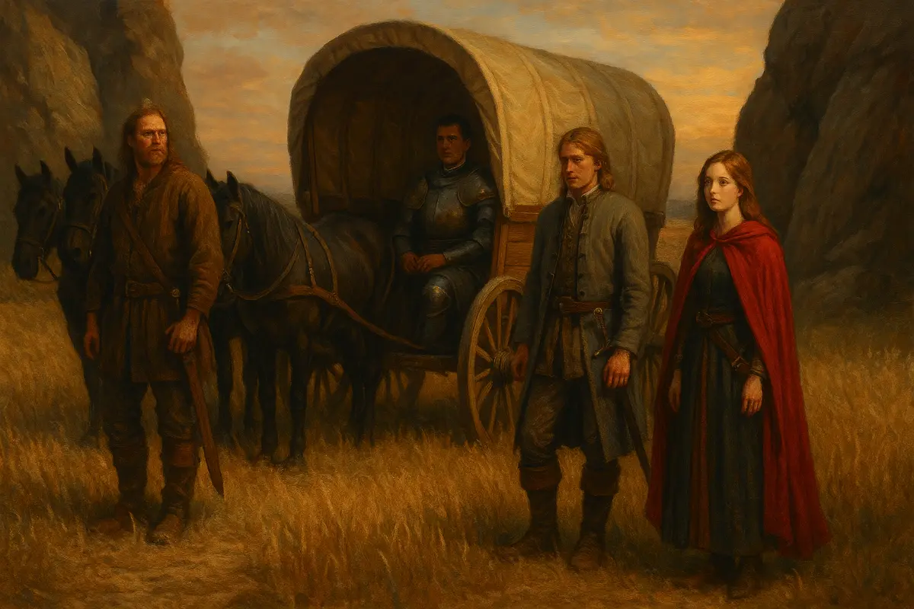
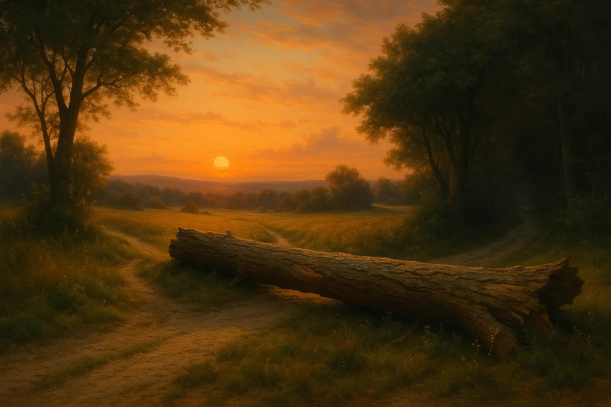
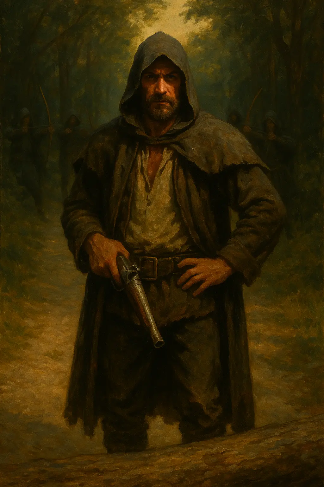
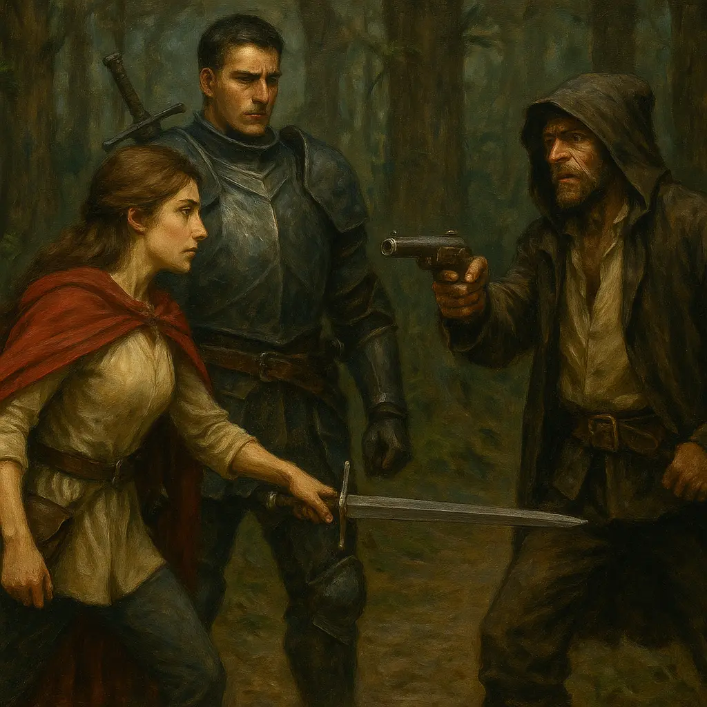
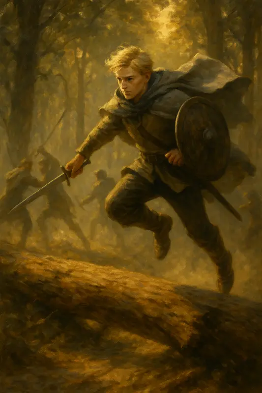
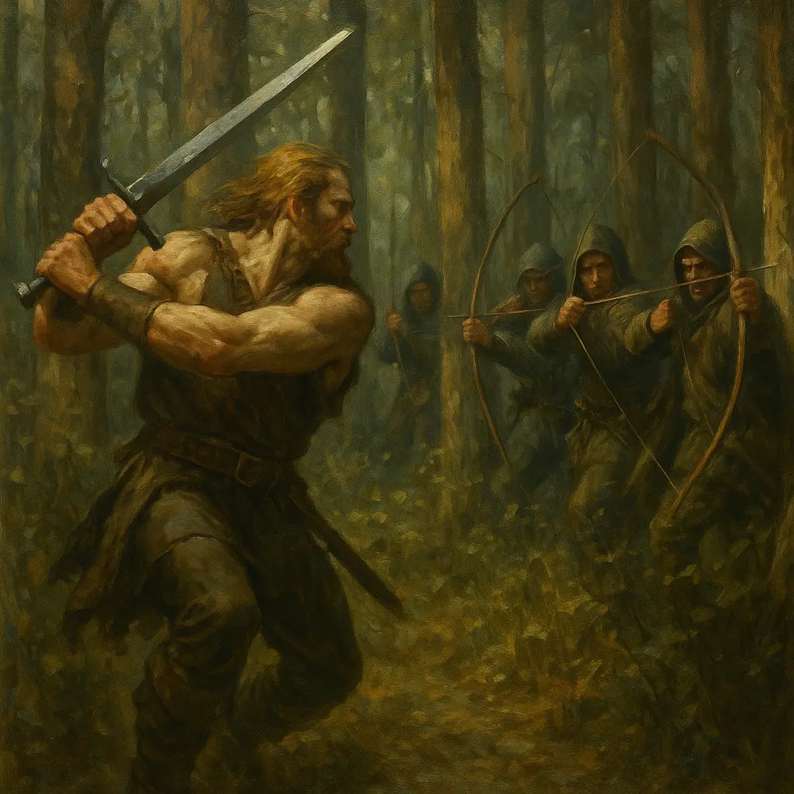
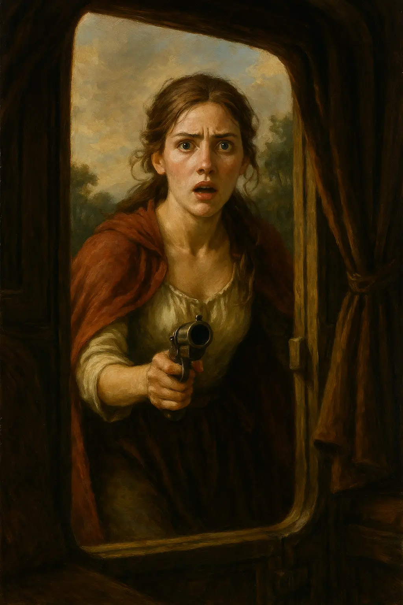

Ens llevàrem a primera hora, disposats a emprendre el camí de retorn a Valdeluna. La Grace ja tenia preparat un carro amb quatre cavalls negres com la nit i prou provisions per a tres jornades. A més, ens obsequià amb tres caixes de whisky i un sac d’opi del bo, recordant-nos amb un somriure que “la pau d’esperit també és un tresor que cal repartir”.

Partírem en Günnar, Kamui, Helen i jo; la resta de companys encara tenien assumptes pendents a la ciutat.

El primer dia transcorregué sense cap incident. El sol, suau i generós, ens acompanyà mentre travessàvem les àmplies planes que separen Magerit dels turons del sud. Les rodes del carro rodolaven amb un ritme constant i hipnòtic, i només el cant llunyà d’algun ocell o el bufar del vent entre els matolls trencava el silenci. A la posta, férem nit entre dues grans roques, enmig d’una immensa esplanada de blat daurat; el lloc era obert i tranquil, amb prou visibilitat per albirar qualsevol perill abans no ens sorprengués.

L’endemà, a l’alba i després d’un esmorzar frugal, reprenguérem la marxa. La llum matinal, tènue i rosada, es filtrava entre núvols com si el dia dubtés a esclatar del tot. No havíem recorregut gaire quan topàrem amb una bifurcació. El camí que havia de dur-nos a Valdeluna era tallat per un arbre caigut. El tronc, d’un metre i mig de diàmetre i més de deu metres de llarg, ocupava tota la via. No semblava un accident: el tall era massa net, la caiguda massa precisa.

Baixàrem del carro i inspeccionàrem el terreny. L’escena feia olor de trampa: potser uns bandits comuns, o pitjor encara, algú que coneixia el nostre botí i el nostre itinerari. Durant uns instants debatérem en silenci; aquella tensió muda que precedeix les decisions difícils: seguir pel desviament o desafiar el perill. Finalment, coincidírem que, si l’objectiu dels qui ens esperaven era fer-nos desviar, la millor resposta era no fer-los el joc.

La Helen dissenyà un pla senzill i efectiu. En Günnar i jo faríem palanca amb dues branques per aixecar lleugerament el tronc, mentre els cavalls, guiats per en Kamui, estirarien amb força fins a fer-lo pivotar fora del camí. Ella, mentrestant, vigilava els voltants amb la mà a la guarda de l’espasa. El treball fou lent i feixuc; el tronc s’alçava amb resistència, grinyolant com si fos viu. El terra cruixia sota el seu pes i la suor m’encegà els ulls.

—Has sentit això? —murmurà en Kamui, amb to greu.

Vaig contenir la respiració i vaig mirar al voltant.

—Sí… —vaig respondre.

I aleshores, enmig del silenci que seguí, alguna cosa es mogué entre els arbres. Un home s’hi plantà, dret com un pal, al mig de la via. Portava caputxa i una jaqueta bruta; amb un gest de falsa cortesia, apartà la roba per mostrar un trabuc que duia a la cintura. Entre les ombres dels arbres se’ns revelaren almenys sis figures d’arquers, quiets, apuntant-nos.

—Bon dia a tothom! —cridà l’home—. Vaja, veig que heu tocat el nostre arbre. Us haurem de fer pagar.

—Bon dia, senyor. És aquest el seu arbre? Me n’alegro —li responguí amb to de falsa ingenuïtat—. Ja se’l pot endur a casa.

La seva rialla fou curta. —Sembla que no entens bé la situació, jove. Els meus homes us apunten amb arcs. Si no voleu prendre mal, deixeu que ens enduguem el carro i les vostres armes.

—Em podria dir el seu nom, senyor? —vaig demanar.

—No és de la teva incumbència. Aparteu-vos del carro.

—Senyor “*no és de la teva incumbència”*,li ofereixo dues formes de pagament: cent gremials en metàl·lic, o tres hòsties amb la mà oberta.

—Apunteu! —ordenà l’home.

—D’acord, tres hòsties amb la mà oberta. —La tensió es trencà com una corda massa estirada.

—Dispareu! —ordenà llavors.

Els arcs es tensaren; aquell instant que precedeix la mort s’allargà com una ombra. En Kamui, mestre dels tirs ràpids, no perdé el temps: apuntà amb i disparà. El tret impactà el que semblava cap de la banda; el seu crit fou curt i la sang tenyí la camisa a l’espatlla. Era una ferida greu, però no letal.

La Helen s’hi llançà sense vacil·lar. La seva espasa dansà entre ombres i tirs; jo, recolzant la mà sobre el tronc, vaig fer una tombarella que em deixà dempeus i llest, com qui s’aixeca per entrar a la cursa. —Ara! —cridà la Helen, i m’hi aboque.

En aquell moment en Günnar s’endinsà entre els arbres cap als arquers; la seva enorme figura avançava decidida. La lluita fou ferotge: era força contra destresa, ordre contra improvisació. Durant una pausa breu jo cridí al cap:

—Senyor, li aconsello deixar-ho aquí, abans no prenguin un mal irreparable.

No em respongué. I aleshores, del bosc, en sortiren quatre més: la proporció canvià, eren cinc contra nosaltres tres. La Helen em cridà mentre combatia: algú remenava el carro. S’hi aproximà i descobrí una noia jove, nerviosa, remenant cofres amb els plànols a la mà. Sense pensar, la Helen apuntà:

—Alto! Deixa els papers!

La por tanca les oïdes; la noia no s’aturà. La Helen disparà. El tret fou net i encertà al cap; la noia caigué immòbil.

La Helen restà paralitzada, el món li trencà la respiració en un instant: l’impacte, el silenci, la incredulitat.

—Eva!! —El cap de la banda, malferit i fora de si, volà cap al carro. Al veure la noia, una llàgrima li ratllà la galta mentre cridava: —Retirada!!

Quatre arquers, confusos, fugiren entre els arbres. Dos bandits restaren atrapats en la voràgine del combat; en Kamui, amb la seva força serena, els reduí i els lligà. El cap, amb la noia en braços, desaparegué en el bosc; coneixia aquell laberint millor que nosaltres i s’esmunyí com una ombra. Jo intentí perseguir-lo, però la foscor entre les alzines l’engolí massa aviat.

Ens reunírem al voltant dels dos capturats, polsosos i amb l’adrenalina a flor de pell, i discutírem el seu destí. En Günnar, sempre pràctic, proposava portar-los davant el capità a Valdeluna: calia esbrinar si eren simples bandolers o peces d’una trama més àmplia. Un dels presoners, amb la veu trencada i ulls plens de por, suplicà:

—No, no volem problemes. Soc en Sergio. Si us plau, no ens feu mal. —L’altre restà mut, amb la mirada clavada a terra, i no volgué dir res

—Ens heu intentat matar, tu i els teus companys —li etzibí—. No ploris misericòrdia.

Els interrogàrem amb la brevetat dels qui necessiten respostes ràpides; confirmaren el nom del cap —en Juan— i declararen el que qualsevol acusat diria: que eren bandits i que només robaven viatgers. No podíem confiar només en paraules pronunciades sota la por. Els lligàrem amb cura, els asseguràrem amb nusos ferms, i decidírem conduir-los a Valdeluna: el camí seria llarg i, el judici, de la ciutat.

Abans d’arrencar el carro, vam llençar una última mirada cap al bosc. La Helen, encara blanca pel xoc, romania muda. Jo mirí el tronc que ens havia aturat i vaig pensar que aquell arbre caigut no era només una maniobra per robar-nos; era un missatge: algú sabia els nostres passos i tenia la sang freda d’ordir una emboscada. Tots sentíem el mateix:**una ombra s’havia estès sobre el nostre viatge**.
